# React基础

## React介绍

React由Meta公司开发，是一个用于 构建Web和原生交互界面的库


### React的优势

相较于传统基于DOM开发的优势

1. 组件化的开发方式
2. 不错的性能

相较于其它前端框架的优势

1. 丰富的生态
2. 跨平台支持

### React的市场情况

全球最流行，大厂必备


## 开发环境创建

create-react-app是一个快速创建React开发环境的工具，底层由Webpack构件，封装了配置细节，开箱即用
执行命令：

```bash
npx create-react-app react-basic
```

1. npx -  Node.js工具命令，查找并执行后续的包命令
2. create-react-app - 核心包（固定写法），用于创建React项目
3. react-basic  React项目的名称（可以自定义）
   :::warning
   创建React项目的更多方式
   [https://zh-hans.react.dev/learn/start-a-new-react-project](https://zh-hans.react.dev/learn/start-a-new-react-project)
   :::

## JSX基础

### 什么是JSX

> 概念：JSX是JavaScript和XMl(HTML)的缩写，表示在JS代码中编写HTML模版结构，它是React中构建UI的方式

```jsx
const message = 'this is message'

function App(){
  return (
    <div>
      <h1>this is title</h1>
      {message}
    </div>
  )
}
```

优势：

1. HTML的声明式模版写法
2. JavaScript的可编程能力

### JSX的本质

> JSX并不是标准的JS语法，它是 JS的语法扩展，浏览器本身不能识别，需要通过解析工具做解析之后才能在浏览器中使用


### JSX高频场景-JS表达式

> 在JSX中可以通过 `大括号语法{}` 识别JavaScript中的表达式，比如常见的变量、函数调用、方法调用等等

1. 使用引号传递字符串
2. 使用JS变量
3. 函数调用和方法调用
4. 使用JavaScript对象
   :::warning
   注意：if语句、switch语句、变量声明不属于表达式，不能出现在{}中
   :::

```jsx
const message = 'this is message'

function getAge(){
  return 18
}

function App(){
  return (
    <div>
      <h1>this is title</h1>
      {/* 字符串识别 */}
      {'this is str'}
      {/* 变量识别 */}
      {message}
      {/* 变量识别 */}
      {message}
      {/* 函数调用 渲染为函数的返回值 */}
      {getAge()}
    </div>
  )
}
```

### JSX高频场景-列表渲染


> 在JSX中可以使用原生js种的`map方法` 实现列表渲染   循环哪个结构，就返回哪个，需要唯一key

```jsx
const list = [
    {id: 1001, name: 'Vue'},
    {id: 1002, name: 'React'},
    {id: 1003, name: 'Angular'},
    {id: 1004, name: '小猜'}
]

function App(){
  return (
    <ul>
      {list.map(item=><li key={item.id}>{item}</li>)}
    </ul>
  )
}
```

### JSX高频场景-条件渲染


> 在React中，可以通过逻辑与运算符&&、三元表达式(?:) 实现基础的条件渲染

```jsx
const flag = true
const loading = false

function App(){
  return (
    <>
      {flag && <span>this is span</span>}
      {loading ? <span>loading...</span>:<span>this is span</span>}
    </>
  )
}
```

### JSX高频场景-复杂条件渲染


> 需求：列表中需要根据文章的状态适配
> 解决方案：自定义函数 + 判断语句

```jsx
const type = 1  // 0|1|3

function getArticleJSX(){
  if(type === 0){
    return <div>无图模式模版</div>
  }else if(type === 1){
    return <div>单图模式模版</div>
  }else(type === 3){
    return <div>三图模式模版</div>
  }
}

function App(){
  return (
    <>
      { getArticleJSX() }
    </>
  )
}
```

## React的事件绑定

### 基础实现

> React中的事件绑定，通过语法 `on + 事件名称 = { 事件处理程序 }`，整体上遵循驼峰命名法

```jsx
function App(){
  const clickHandler = ()=>{
    console.log('button按钮点击了')
  }
  return (
    <button onClick={clickHandler}>click me</button>
  )
}
```

### 使用事件参数

> 在事件回调函数中设置形参e即可

```jsx
function App(){
  const clickHandler = (e)=>{
    console.log('button按钮点击了', e)
  }
  return (
    <button onClick={clickHandler}>click me</button>
  )
}
```

### 传递自定义参数

> 语法：事件绑定的位置改造成箭头函数的写法，在执行clickHandler实际处理业务函数的时候传递实参

```jsx
function App(){
  const clickHandler = (name)=>{
    console.log('button按钮点击了', name)
  }
  return (
    <button onClick={()=>clickHandler('jack')}>click me</button>
  )
}
```

:::warning
注意：不能直接写函数调用，这里事件绑定需要一个函数引用
:::

### 同时传递事件对象和自定义参数

> 语法：在事件绑定的位置传递事件实参e和自定义参数，clickHandler中声明形参，注意顺序对应

```jsx
function App(){
  const clickHandler = (name,e)=>{
    console.log('button按钮点击了', name,e)
  }
  return (
    <button onClick={(e)=>clickHandler('jack',e)}>click me</button>
  )
}
```

## React组件基础使用

### 组件是什么

概念：一个组件就是一个用户界面的一部分，它可以有自己的逻辑和外观，组件之间可以互相嵌套，也可以服用多次


### 组件基础使用

> 在React中，一个组件就是**首字母大写的函数**，内部存放了组件的逻辑和视图UI, 渲染组件只需要把组件当成标签书写即可

```jsx
// 1. 定义组件
function Button(){
  return <button>click me</button>
}

// 2. 使用组件
function App(){
  return (
    <div>
      {/* 自闭和 */}
      <Button/>
      {/* 成对标签 */}
      <Button></Button>
    </div>
  )
}
```

## 组件状态管理-useState

### 基础使用

> useState 是一个 React Hook（函数），它允许我们向组件添加一个`状态变量`, 从而控制影响组件的渲染结果
> 和普通JS变量不同的是，状态变量一旦发生变化组件的视图UI也会跟着变化（数据驱动视图）


```jsx
function App(){
   // 定义状态 count状态变量 setCount函数
  const [ count, setCount ] = React.useState(0)
  return (
    <div>
      <button onClick={()=>setCount(count+1)}>{ count }</button>
    </div>
  )
}
```

### 状态的修改规则

> 在React中状态被认为是只读的，我们应该始终`替换它而不是修改它`, 直接修改状态不能引发视图更新


### 修改对象状态

> 对于对象类型的状态变量，应该始终给set方法一个`全新的对象` 来进行修改


```react
    //修改对象状态
    const [from, setFrom] = useState({name: '小猜', age: 18})
    const handlerClickFrom = () => ({
        ...from,
        age: 22
    })
```


```react
       <div>
            <button onClick={() => setFrom(handlerClickFrom())}>{from.age}</button>
        </div>
```

### 组件的基础样式处理

> React组件基础的样式控制有俩种方式，行内样式和class类名控制

```jsx
<div style={{ color:'red'}}>this is div</div>
```

```css
.foo{
  color: red;
}
```

```jsx
import './index.css'

function App(){
  return (
    <div>
      <span className="foo">this is span</span>
    </div>
  )
}
```

## B站评论案例


1. 渲染评论列表
2. 删除评论实现
3. 渲染导航Tab和高亮实现
4. 评论列表排序功能实现
5. https://www.lodashjs.com/  js工具

### 基础模版

```tsx
import { useState } from 'react'
import './App.scss'
import avatar from './images/bozai.png'

/**
 * 评论列表的渲染和操作
 *
 * 1. 根据状态渲染评论列表
 * 2. 删除评论
 */

// 评论列表数据
const defaultList = [
  {
    // 评论id
    rpid: 3,
    // 用户信息
    user: {
      uid: '13258165',
      avatar: '',
      uname: '周杰伦',
    },
    // 评论内容
    content: '哎哟，不错哦',
    // 评论时间
    ctime: '10-18 08:15',
    like: 88,
  },
  {
    rpid: 2,
    user: {
      uid: '36080105',
      avatar: '',
      uname: '许嵩',
    },
    content: '我寻你千百度 日出到迟暮',
    ctime: '11-13 11:29',
    like: 88,
  },
  {
    rpid: 1,
    user: {
      uid: '30009257',
      avatar,
      uname: '黑马前端',
    },
    content: '学前端就来黑马',
    ctime: '10-19 09:00',
    like: 66,
  },
]
// 当前登录用户信息
const user = {
  // 用户id
  uid: '30009257',
  // 用户头像
  avatar,
  // 用户昵称
  uname: '黑马前端',
}

/**
 * 导航 Tab 的渲染和操作
 *
 * 1. 渲染导航 Tab 和高亮
 * 2. 评论列表排序
 *  最热 => 喜欢数量降序
 *  最新 => 创建时间降序
 */

// 导航 Tab 数组
const tabs = [
  { type: 'hot', text: '最热' },
  { type: 'time', text: '最新' },
]

const App = () => {
  return (
    <div className="app">
      {/* 导航 Tab */}
      <div className="reply-navigation">
        <ul className="nav-bar">
          <li className="nav-title">
            <span className="nav-title-text">评论</span>
            {/* 评论数量 */}
            <span className="total-reply">{10}</span>
          </li>
          <li className="nav-sort">
            {/* 高亮类名： active */}
            <span className='nav-item'>最新</span>
            <span className='nav-item'>最热</span>
          </li>
        </ul>
      </div>

      <div className="reply-wrap">
        {/* 发表评论 */}
        <div className="box-normal">
          {/* 当前用户头像 */}
          <div className="reply-box-avatar">
            <div className="bili-avatar">
              
            </div>
          </div>
          <div className="reply-box-wrap">
            {/* 评论框 */}
            <textarea
              className="reply-box-textarea"
              placeholder="发一条友善的评论"
            />
            {/* 发布按钮 */}
            <div className="reply-box-send">
              <div className="send-text">发布</div>
            </div>
          </div>
        </div>
        {/* 评论列表 */}
        <div className="reply-list">
          {/* 评论项 */}
          <div className="reply-item">
            {/* 头像 */}
            <div className="root-reply-avatar">
              <div className="bili-avatar">
                
              </div>
            </div>

            <div className="content-wrap">
              {/* 用户名 */}
              <div className="user-info">
                <div className="user-name">jack</div>
              </div>
              {/* 评论内容 */}
              <div className="root-reply">
                <span className="reply-content">这是一条评论回复</span>
                <div className="reply-info">
                  {/* 评论时间 */}
                  <span className="reply-time">{'2023-11-11'}</span>
                  {/* 评论数量 */}
                  <span className="reply-time">点赞数:{100}</span>
                  <span className="delete-btn">
                    删除
                  </span>

                </div>
              </div>
            </div>
          </div>
        </div>
      </div>
    </div>
  )
}

export default App
```

```css
.app {
  width: 80%;
  margin: 50px auto;
}

.reply-navigation {
  margin-bottom: 22px;

  .nav-bar {
    display: flex;
    align-items: center;
    margin: 0;
    padding: 0;
    list-style: none;

    .nav-title {
      display: flex;
      align-items: center;
      width: 114px;
      font-size: 20px;

      .nav-title-text {
        color: #18191c;
        font-weight: 500;
      }
      .total-reply {
        margin: 0 36px 0 6px;
        color: #9499a0;
        font-weight: normal;
        font-size: 13px;
      }
    }

    .nav-sort {
      display: flex;
      align-items: center;
      color: #9499a0;
      font-size: 13px;

      .nav-item {
        cursor: pointer;

        &:hover {
          color: #00aeec;
        }

        &:last-child::after {
          display: none;
        }
        &::after {
          content: ' ';
          display: inline-block;
          height: 10px;
          width: 1px;
          margin: -1px 12px;
          background-color: #9499a0;
        }
      }

      .nav-item.active {
        color: #18191c;
      }
    }
  }
}

.reply-wrap {
  position: relative;
}
.box-normal {
  display: flex;
  transition: 0.2s;

  .reply-box-avatar {
    display: flex;
    align-items: center;
    justify-content: center;
    width: 80px;
    height: 50px;
  }

  .reply-box-wrap {
    display: flex;
    position: relative;
    flex: 1;

    .reply-box-textarea {
      width: 100%;
      height: 50px;
      padding: 5px 10px;
      box-sizing: border-box;
      color: #181931;
      font-family: inherit;
      line-height: 38px;
      background-color: #f1f2f3;
      border: 1px solid #f1f2f3;
      border-radius: 6px;
      outline: none;
      resize: none;
      transition: 0.2s;

      &::placeholder {
        color: #9499a0;
        font-size: 12px;
      }
      &:focus {
        height: 60px;
        background-color: #fff;
        border-color: #c9ccd0;
      }
    }
  }

  .reply-box-send {
    position: relative;
    display: flex;
    flex-basis: 86px;
    align-items: center;
    justify-content: center;
    margin-left: 10px;
    border-radius: 4px;
    cursor: pointer;
    transition: 0.2s;

    & .send-text {
      position: absolute;
      z-index: 1;
      color: #fff;
      font-size: 16px;
    }
    &::after {
      position: absolute;
      width: 100%;
      height: 100%;
      background-color: #00aeec;
      border-radius: 4px;
      opacity: 0.5;
      content: '';
    }
    &:hover::after {
      opacity: 1;
    }
  }
}
.bili-avatar {
  position: relative;
  display: block;
  width: 48px;
  height: 48px;
  margin: 0;
  padding: 0;
  border-radius: 50%;
}
.bili-avatar-img {
  position: absolute;
  top: 50%;
  left: 50%;
  display: block;
  width: 48px;
  height: 48px;
  object-fit: cover;
  border: none;
  border-radius: 50%;
  image-rendering: -webkit-optimize-contrast;
  transform: translate(-50%, -50%);
}

// 评论列表
.reply-list {
  margin-top: 14px;
}
.reply-item {
  padding: 22px 0 0 80px;
  .root-reply-avatar {
    position: absolute;
    left: 0;
    display: flex;
    justify-content: center;
    width: 80px;
    cursor: pointer;
  }

  .content-wrap {
    position: relative;
    flex: 1;

    &::after {
      content: ' ';
      display: block;
      height: 1px;
      width: 100%;
      margin-top: 14px;
      background-color: #e3e5e7;
    }

    .user-info {
      display: flex;
      align-items: center;
      margin-bottom: 4px;

      .user-name {
        height: 30px;
        margin-right: 5px;
        color: #61666d;
        font-size: 13px;
        line-height: 30px;
        cursor: pointer;
      }
    }

    .root-reply {
      position: relative;
      padding: 2px 0;
      color: #181931;
      font-size: 15px;
      line-height: 24px;
      .reply-info {
        position: relative;
        display: flex;
        align-items: center;
        margin-top: 2px;
        color: #9499a0;
        font-size: 13px;

        .reply-time {
          width: 76px;
          margin-right: 20px;
        }
        .reply-like {
          display: flex;
          align-items: center;
          margin-right: 19px;

          .like-icon {
            width: 14px;
            height: 14px;
            margin-right: 5px;
            color: #9499a0;
            background-position: -153px -25px;
            &:hover {
              background-position: -218px -25px;
            }
          }
          .like-icon.liked {
            background-position: -154px -89px;
          }
        }
        .reply-dislike {
          display: flex;
          align-items: center;
          margin-right: 19px;
          .dislike-icon {
            width: 16px;
            height: 16px;
            background-position: -153px -153px;
            &:hover {
              background-position: -217px -153px;
            }
          }
          .dislike-icon.disliked {
            background-position: -154px -217px;
          }
        }
        .delete-btn {
          cursor: pointer;
          &:hover {
            color: #00aeec;
          }
        }
      }
    }
  }
}

.reply-none {
  height: 64px;
  margin-bottom: 80px;
  color: #99a2aa;
  font-size: 13px;
  line-height: 64px;
  text-align: center;
}
```

### 完成版本

```jsx
 import { useState } from 'react'
import './App.scss'
import avatar from './images/bozai.png'
import orderBy from 'lodash/orderBy'

/**
 * 评论列表的渲染和操作
 *
 * 1. 根据状态渲染评论列表
 * 2. 删除评论
 */

// 评论列表数据
const defaultList = [
  {
    // 评论id
    rpid: 3,
    // 用户信息
    user: {
      uid: '13258165',
      avatar: '',
      uname: '周杰伦',
    },
    // 评论内容
    content: '哎哟，不错哦',
    // 评论时间
    ctime: '10-18 08:15',
    like: 88,
  },
  {
    rpid: 2,
    user: {
      uid: '36080105',
      avatar: '',
      uname: '许嵩',
    },
    content: '我寻你千百度 日出到迟暮',
    ctime: '11-13 11:29',
    like: 88,
  },
  {
    rpid: 1,
    user: {
      uid: '30009257',
      avatar,
      uname: '黑马前端',
    },
    content: '学前端就来黑马',
    ctime: '10-19 09:00',
    like: 66,
  },
]
// 当前登录用户信息
const user = {
  // 用户id
  uid: '30009257',
  // 用户头像
  avatar,
  // 用户昵称
  uname: '黑马前端',
}

/**
 * 导航 Tab 的渲染和操作
 *
 * 1. 渲染导航 Tab 和高亮
 * 2. 评论列表排序
 *  最热 => 喜欢数量降序
 *  最新 => 创建时间降序
 */

// 导航 Tab 数组
const tabs = [
  { type: 'hot', text: '最热' },
  { type: 'time', text: '最新' },
]

const App = () => {
  // 导航 Tab 高亮的状态
  const [activeTab, setActiveTab] = useState('hot')
  const [list, setList] = useState(defaultList)

  // 删除评论
  const onDelete = rpid => {
    // 如果要删除数组中的元素，需要调用 filter 方法，并且一定要调用 setList 才能更新状态
    setList(list.filter(item => item.rpid !== rpid))
  }

  // tab 高亮切换
  const onToggle = type => {
    setActiveTab(type)
    let newList
    if (type === 'time') {
      // 按照时间降序排序
      // orderBy(对谁进行排序, 按照谁来排, 顺序)
      newList = orderBy(list, 'ctime', 'desc')
    } else {
      // 按照喜欢数量降序排序
      newList = orderBy(list, 'like', 'desc')
    }
    setList(newList)
  }

  return (
    <div className="app">
      {/* 导航 Tab */}
      <div className="reply-navigation">
        <ul className="nav-bar">
          <li className="nav-title">
            <span className="nav-title-text">评论</span>
            {/* 评论数量 */}
            <span className="total-reply">{list.length}</span>
          </li>
          <li className="nav-sort">
            {/* 高亮类名： active */}
            {tabs.map(item => {
              return (
                <div
                  key={item.type}
                  className={
                    item.type === activeTab ? 'nav-item active' : 'nav-item'
                  }
                  onClick={() => onToggle(item.type)}
                >
                  {item.text}
                </div>
              )
            })}
          </li>
        </ul>
      </div>

      <div className="reply-wrap">
        {/* 发表评论 */}
        <div className="box-normal">
          {/* 当前用户头像 */}
          <div className="reply-box-avatar">
            <div className="bili-avatar">
              
            </div>
          </div>
          <div className="reply-box-wrap">
            {/* 评论框 */}
            <textarea
              className="reply-box-textarea"
              placeholder="发一条友善的评论"
            />
            {/* 发布按钮 */}
            <div className="reply-box-send">
              <div className="send-text">发布</div>
            </div>
          </div>
        </div>
        {/* 评论列表 */}
        <div className="reply-list">
          {/* 评论项 */}
          {list.map(item => {
            return (
              <div key={item.rpid} className="reply-item">
                {/* 头像 */}
                <div className="root-reply-avatar">
                  <div className="bili-avatar">
                    
                  </div>
                </div>

                <div className="content-wrap">
                  {/* 用户名 */}
                  <div className="user-info">
                    <div className="user-name">{item.user.uname}</div>
                  </div>
                  {/* 评论内容 */}
                  <div className="root-reply">
                    <span className="reply-content">{item.content}</span>
                    <div className="reply-info">
                      {/* 评论时间 */}
                      <span className="reply-time">{item.ctime}</span>
                      {/* 评论数量 */}
                      <span className="reply-time">点赞数:{item.like}</span>
                      {user.uid === item.user.uid && (
                        <span
                          className="delete-btn"
                          onClick={() => onDelete(item.rpid)}
                        >
                          删除
                        </span>
                      )}
                    </div>
                  </div>
                </div>
              </div>
            )
          })}
        </div>
      </div>
    </div>
  )
}

export default App
```


## React表单控制

### 受控绑定

> 概念：使用React组件的状态（useState）控制表单的状态


```jsx
function App(){
  const [value, setValue] = useState('')
  return (
    <input 
      type="text" 
      value={value} 
      onChange={e => setValue(e.target.value)}
    />
  )
}
```

### 非受控绑定

> 概念：通过获取DOM的方式获取表单的输入数据

```jsx
function App(){
  const inputRef = useRef(null)

  const onChange = ()=>{
    console.log(inputRef.current.value)
  }
  
  return (
    <input 
      type="text" 
      ref={inputRef}
      onChange={onChange}
    />
  )
}
```

## 案例-B站评论案例


1. 手机输入框评论内容，并发布评论
2. id处理和时间处理（uuid 和 day.js）

## React组件通信

> 概念：组件通信就是`组件之间的数据传递`, 根据组件嵌套关系的不同，有不同的通信手段和方法


1. A-B 父子通信
2. B-C 兄弟通信
3. A-E 跨层通信

## 父子通信-父传子


### 基础实现

**实现步骤 **

1. 父组件传递数据 - 在子组件标签上绑定属性 
2. 子组件接收数据 - 子组件通过props参数接收数据

```jsx
function Son(props){
  //props 对象里面包含所有父组件传输过来的数据  
  return <div>{ props.name }</div>
}


function App(){
  const name = 'this is app name'
  return (
    <div>
       <Son name={name}/>
    </div>
  )
}
```

### props说明

**props可以传递任意的合法数据**，比如数字、字符串、布尔值、数组、对象、函数、JSX

**props是只读对象**
子组件只能读取props中的数据，不能直接进行修改, 父组件的数据只能由父组件修改 

### 特殊的prop-chilren

> 场景：当我们把内容嵌套在组件的标签内部时，组件会自动在名为children的prop属性中接收该内容

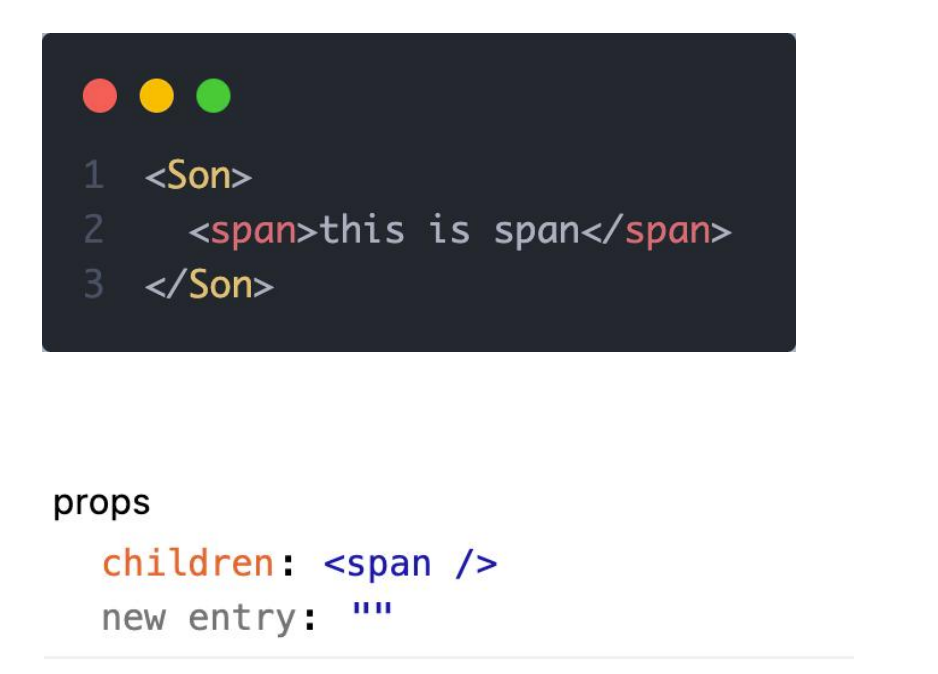

## 父子通信-子传父


> 核心思路：在子组件中调用父组件中的函数并传递参数

```tsx
function Son({ onGetMsg }){
  const sonMsg = 'this is son msg'
  return (
    <div>
      {/* 在子组件中执行父组件传递过来的函数 */}
      <button onClick={()=>onGetMsg(sonMsg)}>send</button>
    </div>
  )
}


function App(){
  const getMsg = (msg)=>console.log(msg)
  
  return (
    <div>
      {/* 传递父组件中的函数到子组件 */}
       <Son onGetMsg={ getMsg }/>
    </div>
  )
}
```

## 兄弟组件通信


> 实现思路: 借助 `状态提升` 机制，通过共同的父组件进行兄弟之间的数据传递
>
> 1. A组件先通过子传父的方式把数据传递给父组件App
> 2. App拿到数据之后通过父传子的方式再传递给B组件

```jsx
// 1. 通过子传父 A -> App
// 2. 通过父传子 App -> B

import { useState } from "react"

function A ({ onGetAName }) {
  // Son组件中的数据
  const name = 'this is A name'
  return (
    <div>
      this is A compnent,
      <button onClick={() => onGetAName(name)}>send</button>
    </div>
  )
}

function B ({ name }) {
  return (
    <div>
      this is B compnent,
      {name}
    </div>
  )
}

function App () {
  const [name, setName] = useState('')
  const getAName = (name) => {
    setName(name)
  }
  return (
    <div>
      this is App
      <A onGetAName={getAName} />
      <B name={name} />
    </div>
  )
}

export default App
```

## 跨层组件通信


**实现步骤：**

1. 使用 `createContext`方法创建一个上下文对象Ctx 
2. 在顶层组件（App）中通过 `Ctx.Provider` 组件提供数据 
3. 在底层组件（B）中通过 `useContext` 钩子函数获取消费数据

```jsx
// App -> A -> B

import { createContext, useContext } from "react"

// 1. createContext方法创建一个上下文对象

const MsgContext = createContext()

function A () {
  return (
    <div>
      this is A component
      <B />
    </div>
  )
}

function B () {
  // 3. 在底层组件 通过useContext钩子函数使用数据
  const msg = useContext(MsgContext)
  return (
    <div>
      this is B compnent,{msg}
    </div>
  )
}

function App () {
  const msg = 'this is app msg'
  return (
    <div>
      {/* 2. 在顶层组件 通过Provider组件提供数据 */}
      <MsgContext.Provider value={msg}>
        this is App
        <A />
      </MsgContext.Provider>
    </div>
  )
}

export default App
```

## React副作用管理-useEffect

### 概念理解 

useEffect是一个React Hook函数，用于在React组件中创建不是由事件引起而是由渲染本身引起的操作（副作用）, 比 如发送AJAX请求，更改DOM等等 
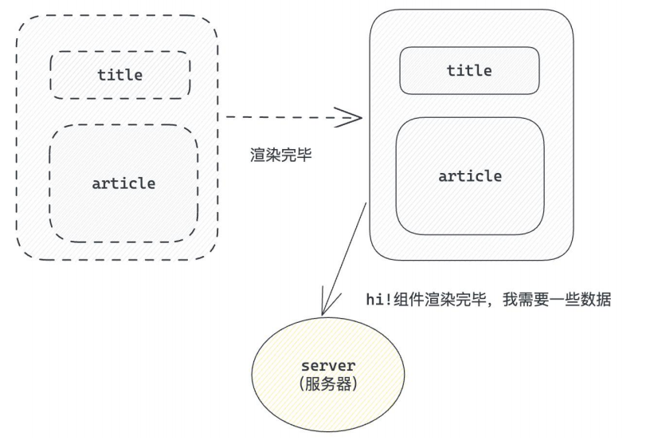
:::warning
说明：上面的组件中没有发生任何的用户事件，组件渲染完毕之后就需要和服务器要数据，整个过程属于“只由渲染引起的操作”
:::

### 基础使用

> 需求：在组件渲染完毕之后，立刻从服务端获取平道列表数据并显示到页面中


说明： 

1. 参数1是一个函数，可以把它叫做副作用函数，在函数内部可以放置要执行的操作 
2. 参数2是一个数组（可选参），在数组里放置依赖项，不同依赖项会影响第一个参数函数的执行，当是一个空数组的时候，副作用函数只会在组件渲染完毕之后执行一次   
   :::warning
   接口地址：http://geek.itheima.net/v1_0/channels
   :::

### useEffect依赖说明 

useEffect副作用函数的执行时机存在多种情况，根据传入依赖项的不同，会有不同的执行表现

| **依赖项**     | **副作用功函数的执行时机**      |
| -------------- | ------------------------------- |
| 没有依赖项     | 组件初始渲染 + 组件更新时执行   |
| 空数组依赖     | 只在初始渲染时执行一次          |
| 添加特定依赖项 | 组件初始渲染 + 依赖项变化时执行 |

### 清除副作用

> 概念：在useEffect中编写的由渲染本身引起的对接组件外部的操作，社区也经常把它叫做副作用操作，比如在useEffect中开启了一个定时器，我们想在组件卸载时把这个定时器再清理掉，这个过程就是清理副作用

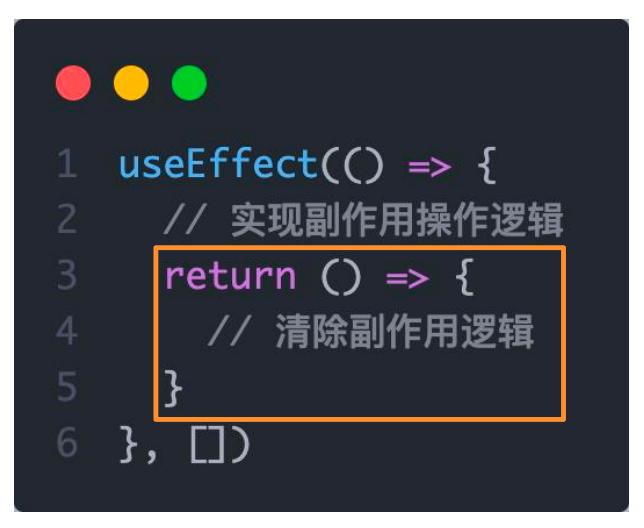
:::warning
说明：清除副作用的函数最常见的执行时机是在组件卸载时自动执行
:::

```jsx
import { useEffect, useState } from "react"

function Son () {
  // 1. 渲染时开启一个定时器
  useEffect(() => {
    const timer = setInterval(() => {
      console.log('定时器执行中...')
    }, 1000)

    return () => {
      // 清除副作用(组件卸载时)
      clearInterval(timer)
    }
  }, [])
  return <div>this is son</div>
}

function App () {
  // 通过条件渲染模拟组件卸载
  const [show, setShow] = useState(true)
  return (
    <div>
      {show && <Son />}
      <button onClick={() => setShow(false)}>卸载Son组件</button>
    </div>
  )
}

export default App
```

## 自定义Hook实现

> 概念：自定义Hook是以 `use打头的函数`，通过自定义Hook函数可以用来`实现逻辑的封装和复用`


```jsx
// 封装自定义Hook

// 问题: 布尔切换的逻辑 当前组件耦合在一起的 不方便复用

// 解决思路: 自定义hook

import { useState } from "react"

function useToggle () {
  // 可复用的逻辑代码
  const [value, setValue] = useState(true)

  const toggle = () => setValue(!value)

  // 哪些状态和回调函数需要在其他组件中使用 return
  return {
    value,
    toggle
  }
}

// 封装自定义hook通用思路

// 1. 声明一个以use打头的函数
// 2. 在函数体内封装可复用的逻辑（只要是可复用的逻辑）
// 3. 把组件中用到的状态或者回调return出去（以对象或者数组）
// 4. 在哪个组件中要用到这个逻辑，就执行这个函数，解构出来状态和回调进行使用


function App () {
  const { value, toggle } = useToggle()
  return (
    <div>
      {value && <div>this is div</div>}
      <button onClick={toggle}>toggle</button>
    </div>
  )
}

export default App
```

## React Hooks使用规则

1. 只能在组件中或者其他自定义Hook函数中调用
2. 只能在组件的顶层调用，不能嵌套在if、for、其它的函数中


## 案例-优化B站评论案例


1. 使用请求接口的方式获取评论列表并渲染 

   ```js
   npm i json-server -D
   ```

   ```js
   npm i axios
   ```

   ```react
       "serve": "json-server db.json --port 3004"
   ```

   

   ```react
       const [list, setList] = useState([])
       useEffect(() => {
           // 请求数据
           async function getList() {
               const res = await axios.get('http://localhost:3004/list');
               setList(res.data)
           }
   
           getList()
       }, []);
   ```

2. 使用自定义Hook函数封装数据请求的逻辑 

   ```react
   //封装请求数据的hook
   function useGetList() {
       const [list, setList] = useState([])
       useEffect(() => {
           // 请求数据
           async function getList() {
               const res = await axios.get('http://localhost:3004/list');
               setList(res.data)
           }
   
           getList()
       }, []);
       return [list, setList]
   }
   ```

   ```react
       const [list, setList] = useGetList()
   ```

3. 把评论中的每一项抽象成一个独立的组件实现渲染

   ```react
         {/* 评论列表 */}
                   <div className="reply-list">
                       {/* 评论项 */}
                       {list.map(item => (
                           <Item key={item.rpid} item={item} onDel={onDelete}/>
                       ))}
                   </div>
   ```

   ```react
   //封装item组件
   function Item({item,onDel}) {
       return (
           <div key={item.rpid} className="reply-item">
               {/* 头像 */}
               <div className="root-reply-avatar">
                   <div className="bili-avatar">
                       
                   </div>
               </div>
   
               <div className="content-wrap">
                   {/* 用户名 */}
                   <div className="user-info">
                       <div className="user-name">{item.user.uname}</div>
                   </div>
                   {/* 评论内容 */}
                   <div className="root-reply">
                       <span className="reply-content">{item.content}</span>
                       <div className="reply-info">
                           {/* 评论时间 */}
                           <span className="reply-time">{item.ctime}</span>
                           {/* 评论数量 */}
                           <span className="reply-time">点赞数:{item.like}</span>
                           {user.uid === item.user.uid && (
                               <span
                                   className="delete-btn"
                                   onClick={() => onDel(item.rpid)}
                               >删除</span>
                           )}
                       </div>
                   </div>
               </div>
           </div>
       )
   }
   ```

   

# Redux介绍

> Redux 是React最常用的集中状态管理工具，类似于Vue中的Pinia（Vuex），可以独立于框架运行
> 作用：通过集中管理的方式管理应用的状态


**为什么要使用Redux？**

1. 独立于组件，无视组件之间的层级关系，简化通信问题
2. 单项数据流清晰，易于定位bug
3. 调试工具配套良好，方便调试

## Redux快速体验

### 1. 实现计数器

> 需求：不和任何框架绑定，不使用任何构建工具，使用纯Redux实现计数器


使用步骤：

1. 定义一个 reducer 函数 （根据当前想要做的修改返回一个新的状态）
2. 使用createStore方法传入 reducer函数 生成一个store实例对象
3. 使用store实例的 subscribe方法 订阅数据的变化（数据一旦变化，可以得到通知）
4. 使用store实例的 dispatch方法提交action对象 触发数据变化（告诉reducer你想怎么改数据）
5. 使用store实例的 getState方法 获取最新的状态数据更新到视图中

代码实现：

```html
<button id="decrement">-</button>
<span id="count">0</span>
<button id="increment">+</button>

<script src="https://unpkg.com/redux@latest/dist/redux.min.js"></script>

<script>
  // 定义reducer函数 
  // 内部主要的工作是根据不同的action 返回不同的state
  function counterReducer (state = { count: 0 }, action) {
    switch (action.type) {
      case 'INCREMENT':
        return { count: state.count + 1 }
      case 'DECREMENT':
        return { count: state.count - 1 }
      default:
        return state
    }
  }
  // 使用reducer函数生成store实例
  const store = Redux.createStore(counterReducer)

  // 订阅数据变化
  store.subscribe(() => {
    console.log(store.getState())
    document.getElementById('count').innerText = store.getState().count

  })
  // 增
  const inBtn = document.getElementById('increment')
  inBtn.addEventListener('click', () => {
    store.dispatch({
      type: 'INCREMENT'
    })
  })
  // 减
  const dBtn = document.getElementById('decrement')
  dBtn.addEventListener('click', () => {
    store.dispatch({
      type: 'DECREMENT'
    })
  })
</script>
```

### 2. Redux数据流架构

> Redux的难点是理解它对于数据修改的规则, 下图动态展示了在整个数据的修改中，数据的流向


为了职责清晰，Redux代码被分为三个核心的概念，我们学redux，其实就是学这三个核心概念之间的配合，三个概念分别是:

1. state:  一个对象 存放着我们管理的数据
2. action:  一个对象 用来描述你想怎么改数据
3. reducer:  一个函数 根据action的描述更新state

## Redux与React - 环境准备

> Redux虽然是一个框架无关可以独立运行的插件，但是社区通常还是把它与React绑定在一起使用，以一个计数器案例体验一下Redux + React 的基础使用

### 1. 配套工具

> 在React中使用redux，官方要求安装俩个其他插件 - Redux Toolkit 和 react-redux

1. Redux Toolkit（RTK）- 官方推荐编写Redux逻辑的方式，是一套工具的集合集，简化书写方式

2. react-redux - 用来 链接 Redux 和 React组件 的中间件


### 2. 配置基础环境

1.  使用 CRA 快速创建 React 项目

```bash
npx create-react-app react-redux 
```

2.  安装配套工具

```bash
npm i @reduxjs/toolkit  react-redux 
```

3.  启动项目

```bash
npm run start 
```


### 3. store目录结构设计


1. 通常集中状态管理的部分都会单独创建一个单独的 `store` 目录

2. 应用通常会有很多个子store模块，所以创建一个 `modules` 目录，在内部编写业务分类的子store

3. store中的入口文件 index.js 的作用是组合modules中所有的子模块，并导出store

## Redux与React - 实现counter

### 1. 整体路径熟悉


### 2. 使用React Toolkit 创建 counterStore

```javascript
import { createSlice } from '@reduxjs/toolkit'

const counterStore = createSlice({
  // 模块名称独一无二
  name: 'counter',
  // 初始数据
  initialState: {
    count: 1
  },
  // 修改数据的同步方法
  reducers: {
    increment (state) {
      state.count++
    },
    decrement(state){
      state.count--
    }
  }
})
// 结构出actionCreater
const { increment,decrement } = counter.actions

// 获取reducer函数
const counterReducer = counterStore.reducer

// 导出
export { increment, decrement }
export default counterReducer
```

```javascript
import { configureStore } from '@reduxjs/toolkit'

import counterReducer from './modules/counterStore'

export default configureStore({
  reducer: {
    // 注册子模块
    counter: counterReducer
  }
})
```

### 3. 为React注入store

> react-redux负责把Redux和React 链接 起来，内置 Provider组件 通过 store 参数把创建好的store实例注入到应用中，链接正式建立

```jsx
import React from 'react'
import ReactDOM from 'react-dom/client'
import App from './App'
// 导入store
import store from './store'
// 导入store提供组件Provider
import { Provider } from 'react-redux'

ReactDOM.createRoot(document.getElementById('root')).render(
  // 提供store数据
  <Provider store={store}>
    <App />
  </Provider>
)
```

### 4. React组件使用store中的数据

> 在React组件中使用store中的数据，需要用到一个钩子函数 - useSelector，它的作用是把store中的数据映射到组件中，使用样例如下：


### 5. React组件修改store中的数据

> React组件中修改store中的数据需要借助另外一个hook函数 - useDispatch，它的作用是生成提交action对象的dispatch函数，使用样例如下：


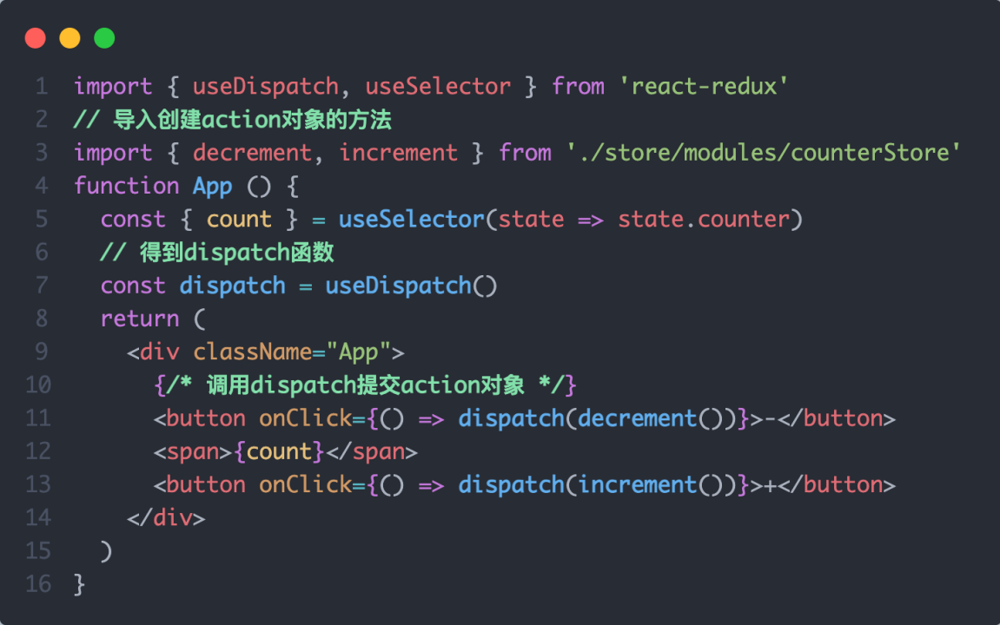

## Redux与React - 提交action传参

> 需求：组件中有俩个按钮 `add to 10` 和 `add to 20` 可以直接把count值修改到对应的数字，目标count值是在组件中传递过去的，需要在提交action的时候传递参数


实现方式：在reducers的同步修改方法中添加action对象参数，在调用actionCreater的时候传递参数，参数会被传递到action对象payload属性上


## Redux与React - 异步action处理

**需求理解**


**实现步骤**

1. 创建store的写法保持不变，配置好同步修改状态的方法
2. 单独封装一个函数，在函数内部return一个新函数，在新函数中
   2.1 封装异步请求获取数据
   2.2 调用同步actionCreater传入异步数据生成一个action对象，并使用dispatch提交
3. 组件中dispatch的写法保持不变

**代码实现**

> 测试接口地址：  [http://geek.itheima.net/v1_0/channels](http://geek.itheima.net/v1_0/channels')

```javascript
import { createSlice } from '@reduxjs/toolkit'
import axios from 'axios'

const channelStore = createSlice({
  name: 'channel',
  initialState: {
    channelList: []
  },
  reducers: {
    setChannelList (state, action) {
      state.channelList = action.payload
    }
  }
})


// 创建异步
const { setChannelList } = channelStore.actions
const url = 'http://geek.itheima.net/v1_0/channels'
// 封装一个函数 在函数中return一个新函数 在新函数中封装异步
// 得到数据之后通过dispatch函数 触发修改
const fetchChannelList = () => {
  return async (dispatch) => {
    const res = await axios.get(url)
    dispatch(setChannelList(res.data.data.channels))
  }
}

export { fetchChannelList }

const channelReducer = channelStore.reducer
export default channelReducer
```

```jsx
import { useEffect } from 'react'
import { useSelector, useDispatch } from 'react-redux'
import { fetchChannelList } from './store/channelStore'

function App () {
  // 使用数据
  const { channelList } = useSelector(state => state.channel)
  useEffect(() => {
    dispatch(fetchChannelList())
  }, [dispatch])

  return (
    <div className="App">
      <ul>
        {channelList.map(task => <li key={task.id}>{task.name}</li>)}
      </ul>
    </div>
  )
}

export default App
```

## Redux调试 - devtools

> Redux官方提供了针对于Redux的调试工具，支持实时state信息展示，action提交信息查看等


## 美团小案例

### 1. 案例演示


> 基本开发思路：使用 RTK（Redux Toolkit）来管理应用状态, 组件负责 数据渲染 和 dispatch action

### 2. 准备并熟悉环境

1.  克隆项目到本地（内置了基础静态组件和模版）

```bash
git clone http://git.itcast.cn/heimaqianduan/redux-meituan.git 
```

2.  安装所有依赖

```bash
npm i 
```

3.  启动mock服务（内置了json-server）

```bash
npm run serve 
```

4.  启动前端服务

```bash
npm run start 
```

### 3. 分类和商品列表渲染


1- 编写store逻辑

```javascript
// 编写store
import { createSlice } from "@reduxjs/toolkit"
import axios from "axios"

const foodsStore = createSlice({
  name: 'foods',
  initialState: {
    // 商品列表
    foodsList: []
  },
  reducers: {
    // 更改商品列表
    setFoodsList (state, action) {
      state.foodsList = action.payload
    }
  }
})

// 异步获取部分
const { setFoodsList } = foodsStore.actions
const fetchFoodsList = () => {
  return async (dispatch) => {
    // 编写异步逻辑
    const res = await axios.get('http://localhost:3004/takeaway')
    // 调用dispatch函数提交action
    dispatch(setFoodsList(res.data))
  }
}

export { fetchFoodsList }

const reducer = foodsStore.reducer

export default reducer
```

2- 组件使用store数据

```jsx
// 省略部分代码
import { useDispatch, useSelector } from 'react-redux'
import { fetchFoodsList } from './store/modules/takeaway'
import { useEffect } from 'react'

const App = () => {
  // 触发action执行
  // 1. useDispatch -> dispatch 2. actionCreater导入进来 3.useEffect
  const dispatch = useDispatch()
  useEffect(() => {
    dispatch(fetchFoodsList())
  }, [dispatch])

  return (
    <div className="home">
      {/* 导航 */}
      <NavBar />

      {/* 内容 */}
      <div className="content-wrap">
        <div className="content">
          <Menu />
          <div className="list-content">
            <div className="goods-list">
              {/* 外卖商品列表 */}
              {foodsList.map(item => {
                return (
                  <FoodsCategory
                    key={item.tag}
                    // 列表标题
                    name={item.name}
                    // 列表商品
                    foods={item.foods}
                  />
                )
              })}
            </div>
          </div>
        </div>
      </div>
      {/* 购物车 */}
      <Cart />
    </div>
  )
}

export default App
```

### 4. 点击分类激活交互实现


1- 编写store逻辑

```javascript
// 编写store

import { createSlice } from "@reduxjs/toolkit"
import axios from "axios"

const foodsStore = createSlice({
  name: 'foods',
  initialState: {
    // 菜单激活下标值
    activeIndex: 0
  },
  reducers: {
    // 更改activeIndex
    changeActiveIndex (state, action) {
      state.activeIndex = action.payload
    }
  }
})

// 导出
const { changeActiveIndex } = foodsStore.actions

export { changeActiveIndex }

const reducer = foodsStore.reducer

export default reducer
```

2- 编写组件逻辑

```jsx
const Menu = () => {
  const { foodsList, activeIndex } = useSelector(state => state.foods)
  const dispatch = useDispatch()
  const menus = foodsList.map(item => ({ tag: item.tag, name: item.name }))
  return (
    <nav className="list-menu">
      {/* 添加active类名会变成激活状态 */}
      {menus.map((item, index) => {
      return (
        <div
          // 提交action切换激活index
          onClick={() => dispatch(changeActiveIndex(index))}
          key={item.tag}
          // 动态控制active显示
          className={classNames(
            'list-menu-item',
            activeIndex === index && 'active'
          )}
          >
          {item.name}
        </div>
      )
    })}
    </nav>
  )
}
```

### 5. 商品列表切换显示

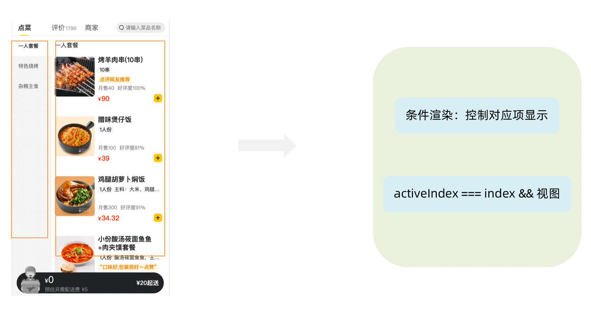

```jsx
<div className="list-content">
  <div className="goods-list">
    {/* 外卖商品列表 */}
    {foodsList.map((item, index) => {
      return (
        activeIndex === index && <FoodsCategory
          key={item.tag}
          // 列表标题
          name={item.name}
          // 列表商品
          foods={item.foods}
        />
      )
    })}
  </div>
</div>
```

### 6. 添加购物车实现


1- 编写store逻辑

```javascript
// 编写store

import { createSlice } from "@reduxjs/toolkit"
import axios from "axios"

const foodsStore = createSlice({
  name: 'foods',
  reducers: {
    // 添加购物车
    addCart (state, action) {
      // 是否添加过？以action.payload.id去cartList中匹配 匹配到了 添加过
      const item = state.cartList.find(item => item.id === action.payload.id)
      if (item) {
        item.count++
      } else {
        state.cartList.push(action.payload)
      }
    }
  }
})

// 导出actionCreater
const { addCart } = foodsStore.actions

export { addCart }

const reducer = foodsStore.reducer

export default reducer
```

2- 编写组件逻辑

```jsx
<div className="goods-count">
  {/* 添加商品 */}
  <span 
    className="plus" 
    onClick={() => dispatch(addCart({
    id,
    picture,
    name,
    unit,
    description,
    food_tag_list,
    month_saled,
    like_ratio_desc,
    price,
    tag,
    count
  }))}></span>
</div>
```

### 7. 统计区域实现

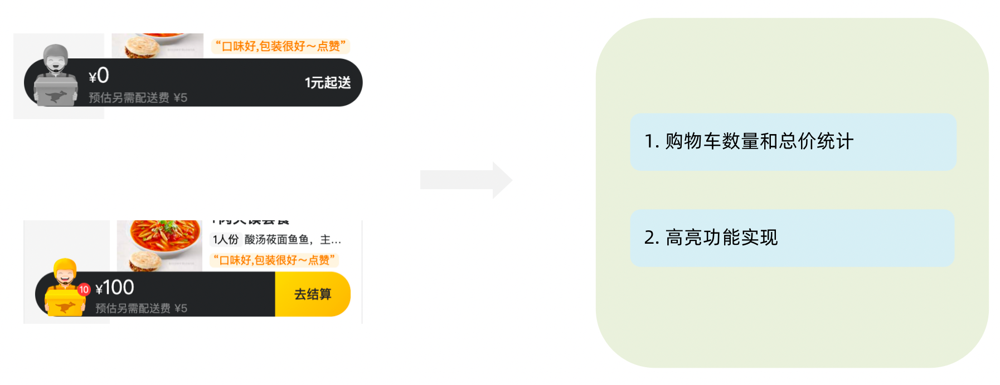

实现思路

1. 基于store中的cartList的length渲染数量
2. 基于store中的cartList累加price * count
3. 购物车cartList的length不为零则高亮

```jsx
// 计算总价 
const totalPrice = cartList.reduce((a, c) => a + c.price * c.count, 0)

{/* fill 添加fill类名购物车高亮*/}
{/* 购物车数量 */}
<div onClick={onShow} className={classNames('icon', cartList.length > 0 && 'fill')}>
  {cartList.length > 0 && <div className="cartCornerMark">{cartList.length}</div>}
</div>
```

### 8. 购物车列表功能实现


1-控制列表渲染

```jsx
const Cart = () => {
  return (
    <div className="cartContainer">
      {/* 添加visible类名 div会显示出来 */}
      <div className={classNames('cartPanel', 'visible')}>
        {/* 购物车列表 */}
        <div className="scrollArea">
          {cartList.map(item => {
            return (
              <div className="cartItem" key={item.id}>
                
                <div className="main">
                  <div className="skuInfo">
                    <div className="name">{item.name}</div>
                  </div>
                  <div className="payableAmount">
                    <span className="yuan">¥</span>
                    <span className="price">{item.price}</span>
                  </div>
                </div>
                <div className="skuBtnWrapper btnGroup">
                  {/* 数量组件 */}
                  <Count
                    count={item.count}
                  />
                </div>
              </div>
            )
          })}
        </div>
      </div>
    </div>
  )
}

export default Cart
```

2- 购物车增减逻辑实现

```javascript
// count增
increCount (state, action) {
  // 关键点：找到当前要修改谁的count id
  const item = state.cartList.find(item => item.id === action.payload.id)
  item.count++
},
// count减
decreCount (state, action) {
  // 关键点：找到当前要修改谁的count id
  const item = state.cartList.find(item => item.id === action.payload.id)
  if (item.count === 0) {
    return
  }
  item.count--
}
```

```jsx
<div className="skuBtnWrapper btnGroup">
  {/* 数量组件 */}
  <Count
    count={item.count}
    onPlus={() => dispatch(increCount({ id: item.id }))}
    onMinus={() => dispatch(decreCount({ id: item.id }))}
    />
</div>
```

3-清空购物车实现

```javascript
// 清除购物车
clearCart (state) {
  state.cartList = []
}
```

```jsx
<div className="header">
  <span className="text">购物车</span>
  <span 
    className="clearCart" 
    onClick={() => dispatch(clearCart())}>
    清空购物车
  </span>
</div>
```

### 9. 控制购物车显示和隐藏


```jsx
// 控制购物车打开关闭的状态
const [visible, setVisible] = useState(false)

const onShow = () => {
  if (cartList.length > 0) {
    setVisible(true)
  }
}


{/* 遮罩层 添加visible类名可以显示出来 */}
<div
	className={
     classNames('cartOverlay', visible && 'visible')
  }
	onClick={() => setVisible(false)}
/>
```


# Router路由

## 路由快速上手

### 1. 什么是前端路由

一个路径 path 对应一个组件 component 当我们在浏览器中访问一个 path 的时候，path 对应的组件会在页面中进行渲染


### 2. 创建路由开发环境

```bash
# 使用CRA创建项目
npm create-react-app react-router-pro

# 安装最新的ReactRouter包
npm i react-router-dom

# 启动项目
npm run start
```

### 3. 快速开始


```jsx
import React from 'react'
import ReactDOM from 'react-dom/client'

const router = createBrowserRouter([
  {
    path:'/login',
    element: <div>登录</div>
  },
  {
    path:'/article',
    element: <div>文章</div>
  }
])

ReactDOM.createRoot(document.getElementById('root')).render(
  <RouterProvider router={router}/>
)
```

## 抽象路由模块


## 路由导航

### 1. 什么是路由导航

路由系统中的多个路由之间需要进行路由跳转，并且在跳转的同时有可能需要传递参数进行通信


### 2. 声明式导航

> 声明式导航是指通过在模版中通过 `<Link/> ` 组件描述出要跳转到哪里去，比如后台管理系统的左侧菜单通常使用这种方式进行


语法说明：通过给组件的to属性指定要跳转到路由path，组件会被渲染为浏览器支持的a链接，如果需要传参直接通过字符串拼接的方式拼接参数即可

### 3. 编程式导航

编程式导航是指通过 `useNavigate` 钩子得到导航方法，然后通过调用方法以命令式的形式进行路由跳转，比如想在登录请求完毕之后跳转就可以选择这种方式，更加灵活


语法说明：通过调用navigate方法传入地址path实现跳转

## 导航传参

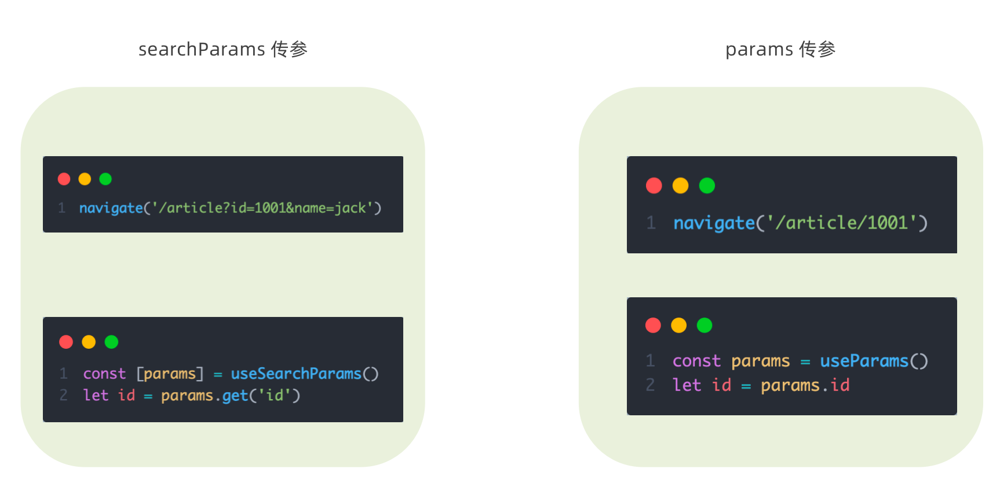

## 嵌套路由配置

### 1. 什么是嵌套路由

在一级路由中又内嵌了其他路由，这种关系就叫做嵌套路由，嵌套至一级路由内的路由又称作二级路由，例如：


### 2. 嵌套路由配置

> 实现步骤
>
>     1. 使用 `children`属性配置路由嵌套关系  
>     2. 使用 `<Outlet/>` 组件配置二级路由渲染位置


### 3. 默认二级路由

当访问的是一级路由时，默认的二级路由组件可以得到渲染，只需要在二级路由的位置去掉path，设置index属性为true


### 4. 404路由配置

场景：当浏览器输入url的路径在整个路由配置中都找不到对应的 path，为了用户体验，可以使用 404 兜底组件进行渲染

实现步骤：

1. 准备一个NotFound组件
2. 在路由表数组的末尾，以*号作为路由path配置路由


### 5. 俩种路由模式

各个主流框架的路由常用的路由模式有俩种，history模式和hash模式, ReactRouter分别由 createBrowerRouter 和 createHashRouter 函数负责创建

| 路由模式 | url表现     | 底层原理                    | 是否需要后端支持 |
| -------- | ----------- | --------------------------- | ---------------- |
| history  | url/login   | history对象 + pushState事件 | 需要             |
| hash     | url/#/login | 监听hashChange事件          | 不需要           |


# Router路由记账本

## 环境搭建

> 使用CRA创建项目，并安装必要依赖，包括下列基础包

1. Redux状态管理 -  @reduxjs/toolkit 、 react-redux
2. 路由 - react-router-dom
3. 时间处理 - dayjs
4. class类名处理 - classnames
5. 移动端组件库 - antd-mobile
6. 请求插件 - axios

## 配置别名路径

### 1. 背景知识

> 1. 路径解析配置（webpack），把 @/ 解析为 src/
> 2. 路径联想配置（VsCode），VsCode 在输入 @/ 时，自动联想出来对应的 src/下的子级目录


### 2. 路径解析配置

配置步骤：

1. 安装craco
   npm i -D @craco/craco
2. 项目根目录下创建配置文件
   craco.config.js
3. 配置文件中添加路径解析配置
4. 包文件中配置启动和打包命令


### 3. 联想路径配置

配置步骤：

1. 根目录下新增配置文件 - jsconfig.json
2. 添加路径提示配置

```json
{
  "compilerOptions":{
    "baseUrl":"./",
    "paths":{
      "@/*":[
        "src/*"
      ]
    }
  }
}
```

## 数据Mock实现

> 在前后端分类的开发模式下，前端可以在没有实际后端接口的支持下先进行接口数据的模拟，进行正常的业务功能开发

### 1. 常见的Mock方式


### 2. json-server实现Mock

实现步骤：

1.  项目中安装json-server
     npm i -D json-server 
2.  准备一个json文件 （素材里获取）
3.  添加启动命令 

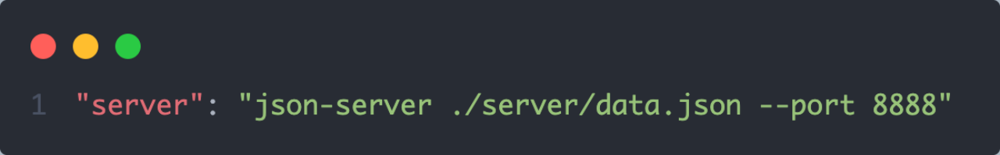

4.  访问接口进行测试 

## 整体路由设计


1. 俩个一级路由 （Layout / new）2. 俩个二级路由 （Layout - mouth/year）

## antD主题定制

### 1. 定制方案


### 2. 实现方式

1. 全局定制

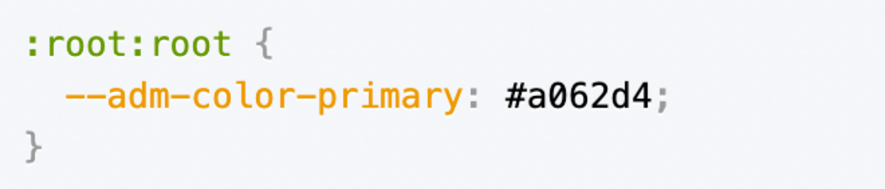

2. 局部定制

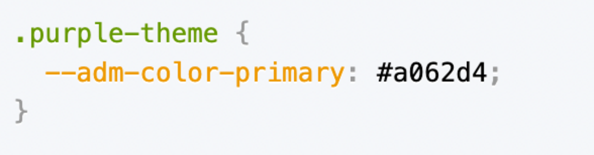

### 3. 记账本主题色

```css
:root:root {
  --adm-color-primary: rgb(105, 174, 120);
}
```

## Redux管理账目列表

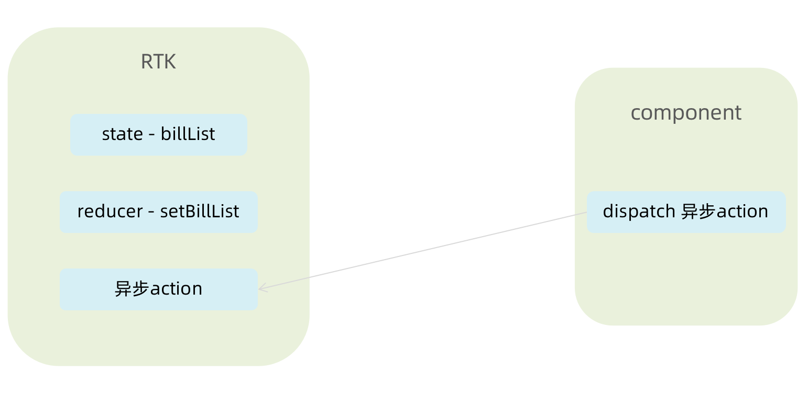

```javascript
// 账单列表相关store

import { createSlice } from '@reduxjs/toolkit'
import axios from 'axios'

const billStore = createSlice({
  name: 'bill',
  // 数据状态state
  initialState: {
    billList: []
  },
  reducers: {
    // 同步修改方法
    setBillList (state, action) {
      state.billList = action.payload
    }
  }
})

// 解构actionCreater函数
const { setBillList } = billStore.actions
// 编写异步
const getBillList = () => {
  return async (dispatch) => {
    // 编写异步请求
    const res = await axios.get('http://localhost:8888/ka')
    // 触发同步reducer
    dispatch(setBillList(res.data))
  }
}

export { getBillList }
// 导出reducer
const reducer = billStore.reducer

export default reducer
```


```javascript
// 组合子模块 导出store实例

import { configureStore } from '@reduxjs/toolkit'
import billReducer from './modules/billStore'

const store = configureStore({
  reducer: {
    bill: billReducer
  }
})

export default store
```

```jsx
import router from './router'
import { Provider } from 'react-redux'

const root = ReactDOM.createRoot(document.getElementById('root'))
root.render(
  <Provider store={store}>
    <RouterProvider router={router} />
  </Provider>
)
```

## TabBar功能实现


### 1. 静态布局实现

配套静态模版和样式文件

```jsx
import { TabBar } from "antd-mobile"
import { useEffect } from "react"
import { Outlet } from "react-router-dom"
import { useDispatch } from 'react-redux'
import { getBillList } from "@/store/modules/billStore"
import './index.scss'
import {
  BillOutline,
  CalculatorOutline,
  AddCircleOutline
} from 'antd-mobile-icons'

const tabs = [
  {
    key: '/month',
    title: '月度账单',
    icon: <BillOutline />,
  },
  {
    key: '/new',
    title: '记账',
    icon: <AddCircleOutline />,
  },
  {
    key: '/year',
    title: '年度账单',
    icon: <CalculatorOutline />,
  },
]

const Layout = () => {
  const dispatch = useDispatch()
  useEffect(() => {
    dispatch(getBillList())
  }, [dispatch])
  return (
    <div className="layout">
      <div className="container">
        <Outlet />
      </div>
      <div className="footer">
        <TabBar>
          {tabs.map(item => (
            <TabBar.Item key={item.key} icon={item.icon} title={item.title} />
          ))}
        </TabBar>
      </div>
    </div>
  )
}

export default Layout
```

```css
.layout {
  .container {
    position: fixed;
    top: 0;
    bottom: 50px;
  }
  .footer {
    position: fixed;
    bottom: 0;
    width: 100%;
  }
}
```

### 2. 切换路由实现

> 监听change事件，在事件回调中调用路由跳转方法

```jsx
 // 切换菜单跳转路由
  const navigate = useNavigate()
  const swithRoute = (path) => {
    console.log(path)
    navigate(path)
  }

  return (
    <div className="layout">
      <div className="footer">
        <TabBar onChange={swithRoute}>
          {/* 省略... */}
        </TabBar>
      </div>
    </div>
  )
```

## 月度账单-统计区域


### 1. 准备静态结构

```jsx
import { NavBar, DatePicker } from 'antd-mobile'
import './index.scss'

const Month = () => {
  return (
    <div className="monthlyBill">
      <NavBar className="nav" backArrow={false}>
        月度收支
      </NavBar>
      <div className="content">
        <div className="header">
          {/* 时间切换区域 */}
          <div className="date">
            <span className="text">
              2023 | 3月账单
            </span>
            <span className='arrow expand'></span>
          </div>
          {/* 统计区域 */}
          <div className='twoLineOverview'>
            <div className="item">
              <span className="money">{100}</span>
              <span className="type">支出</span>
            </div>
            <div className="item">
              <span className="money">{200}</span>
              <span className="type">收入</span>
            </div>
            <div className="item">
              <span className="money">{200}</span>
              <span className="type">结余</span>
            </div>
          </div>
          {/* 时间选择器 */}
          <DatePicker
            className="kaDate"
            title="记账日期"
            precision="month"
            visible={false}
            max={new Date()}
          />
        </div>
      </div>
    </div >
  )
}

export default Month
```

```css
.monthlyBill {
  --ka-text-color: #191d26;
  height: 100%;
  background: linear-gradient(180deg, #ffffff, #f5f5f5 100%);
  background-size: 100% 240px;
  background-repeat: no-repeat;
  background-color: rgba(245, 245, 245, 0.9);
  color: var(--ka-text-color);

  .nav {
    --adm-font-size-10: 16px;
    color: #121826;
    background-color: transparent;
    .adm-nav-bar-back-arrow {
      font-size: 20px;
    }
  }

  .content {
    height: 573px;
    padding: 0 10px;
    overflow-y: scroll;
    -ms-overflow-style: none; /* Internet Explorer 10+ */
    scrollbar-width: none; /* Firefox */
    &::-webkit-scrollbar {
      display: none; /* Safari and Chrome */
    }

    > .header {
      height: 135px;
      padding: 20px 20px 0px 18.5px;
      margin-bottom: 10px;
      background-image: url(https://zqran.gitee.io/images/ka/month-bg.png);
      background-size: 100% 100%;

      .date {
        display: flex;
        align-items: center;
        margin-bottom: 25px;
        font-size: 16px;

        .arrow {
          display: inline-block;
          width: 7px;
          height: 7px;
          margin-top: -3px;
          margin-left: 9px;
          border-top: 2px solid #121826;
          border-left: 2px solid #121826;
          transform: rotate(225deg);
          transform-origin: center;
          transition: all 0.3s;
        }
        .arrow.expand {
          transform: translate(0, 2px) rotate(45deg);
        }
      }
    }
  }
  .twoLineOverview {
    display: flex;
    justify-content: space-between;
    width: 250px;

    .item {
      display: flex;
      flex-direction: column;

      .money {
        height: 24px;
        line-height: 24px;
        margin-bottom: 5px;
        font-size: 18px;
      }
      .type {
        height: 14px;
        line-height: 14px;
        font-size: 12px;
      }
    }
  }
}
```

### 2. 点击切换时间选择框

> 实现思路：
>
> 1. 准备一个状态数据
> 2. 点击切换状态
> 3. 根据状态控制弹框打开关闭以及箭头样式


```jsx
import { NavBar, DatePicker } from 'antd-mobile'
import './index.scss'
import {  useState } from "react"
import classNames from "classnames"

const Month = () => {
  // 控制时间选择器打开关闭
  const [dateVisible, setDateVisible] = useState(false)
  // 时间选择框确实事件
  const dateConfirm = (date) => {
    // 关闭弹框
    setDateVisible(false)
  }

  return (
    <div className="monthlyBill">
      <NavBar className="nav" backArrow={false}>
        月度收支
      </NavBar>
      <div className="content">
        <div className="header">
          {/* 时间切换区域 */}
          <div className="date" onClick={() => setDateVisible(true)}>
            {/* 省略.. */}
            <span className={classNames('arrow', dateVisible && 'expand')}></span>
          </div>
          {/* 统计区域 */}
        
          {/* 时间选择器 */}
          <DatePicker
            className="kaDate"
            title="记账日期"
            precision="month"
            visible={dateVisible}
            max={new Date()}
            onConfirm={dateConfirm}
          />
        </div>
      </div>
    </div >
  )
}

export default Month
```

### 3. 切换时间显示


> 实现思路：
>
> 1. 以当前时间作为默认值
> 2. 在时间切换时完成时间修改


```jsx
import dayjs from "dayjs"

const [currentMonth, setCurrentMonth] = useState(() => {
    return dayjs().format('YYYY-MM')
})

const dateConfirm = (date) => {
  setDateVisible(false)
  const month = dayjs(date).format('YYYY-MM')
  setCurrentMonth(month)
}
```

### 4. 统计功能实现

> 实现思路：
>
> 1. 按月分组
> 2. 根据获取到的时间作为key取当月的账单数组
> 3. 根据当月的账单数组计算支出、收入、总计

```jsx
// 按月分组
const billList = useSelector(state => state.bill.billList)
const monthGroup = useMemo(() => {
  return _.groupBy(billList, item => dayjs(item.date).format('YYYY-MM'))
}, [billList])

// 根据获取到的时间作为key取当月的账单数组
const dateConfirm = (date) => {
  const monthKey = dayjs(date).format('YYYY-MM')
  setMonthList(monthGroup[monthKey])
}

// 计算统计
const overview = useMemo(() => {
  const income = currentMonthList.filter(item => item.type === 'income')
    .reduce((a, c) => a + c.money, 0)
  const pay = currentMonthList.filter(item => item.type === 'pay')
    .reduce((a, c) => a + c.money, 0)
  return {
    income,
    pay,
    total: income + pay
  }
}, [currentMonthList])
```

### 5. 完整代码

```jsx
import { useSelector } from "react-redux"
import { NavBar, DatePicker } from 'antd-mobile'
import './index.scss'
import _ from 'lodash'
import dayjs from "dayjs"
import { useMemo, useState } from "react"
import { useEffect } from "react"
import classNames from "classnames"

const Month = () => {
  // 按月分组
  const billList = useSelector(state => state.bill.billList)
  const monthGroup = useMemo(() => {
    return _.groupBy(billList, item => dayjs(item.date).format('YYYY-MM'))
  }, [billList])

  // 控制时间选择器打开关闭
  const [dateVisible, setDateVisible] = useState(false)
  const [currentMonthList, setMonthList] = useState([])
  const [currentMonth, setCurrentMonth] = useState(() => {
    return dayjs().format('YYYY-MM')
  })

  const dateConfirm = (date) => {
    setDateVisible(false)
    const monthKey = dayjs(date).format('YYYY-MM')
    setCurrentMonth(monthKey)
    setMonthList(monthGroup[monthKey])
  }

  // 首次加载
  useEffect(() => {
    const list = monthGroup[dayjs().format('YYYY-MM')]
    if(list){
      setMonthList(list)
    }
  }, [monthGroup])

  // 计算统计
  const overview = useMemo(() => {
    if (!currentMonthList) return { income: 0, pay: 0, total: 0 }
    const income = currentMonthList.filter(item => item.type === 'income')
      .reduce((a, c) => a + c.money, 0)
    const pay = currentMonthList.filter(item => item.type === 'pay')
      .reduce((a, c) => a + c.money, 0)
    return {
      income,
      pay,
      total: income + pay
    }
  }, [currentMonthList])

  return (
    <div className="monthlyBill">
      <NavBar className="nav" backArrow={false}>
        月度收支
      </NavBar>
      <div className="content">
        <div className="header">
          {/* 时间切换区域 */}
          <div className="date" onClick={() => setDateVisible(true)}>
            <span className="text">
              {currentMonth} 账单
            </span>
            <span className={classNames('arrow', dateVisible && 'expand')}></span>
          </div>
          {/* 统计区域 */}
          <div className='twoLineOverview'>
            <div className="item">
              <span className="money">{overview.pay.toFixed(2)}</span>
              <span className="type">支出</span>
            </div>
            <div className="item">
              <span className="money">{overview.income.toFixed(2)}</span>
              <span className="type">收入</span>
            </div>
            <div className="item">
              <span className="money">{(overview.total).toFixed(2)}</span>
              <span className="type">结余</span>
            </div>
          </div>
          {/* 时间选择器 */}
          <DatePicker
            className="kaDate"
            title="记账日期"
            precision="month"
            visible={dateVisible}
            max={new Date()}
            onConfirm={dateConfirm}
          />
        </div>
      </div>
    </div >
  )
}

export default Month
```

## 月度账单-单日统计列表实现


### 1. 准备组件和配套样式

```jsx
import classNames from 'classnames'
import './index.scss'

const DailyBill = () => {
  return (
    <div className={classNames('dailyBill')}>
      <div className="header">
        <div className="dateIcon">
          <span className="date">{'03月23日'}</span>
          <span className={classNames('arrow')}></span>
        </div>
        <div className="oneLineOverview">
          <div className="pay">
            <span className="type">支出</span>
            <span className="money">{100}</span>
          </div>
          <div className="income">
            <span className="type">收入</span>
            <span className="money">{200}</span>
          </div>
          <div className="balance">
            <span className="money">{100}</span>
            <span className="type">结余</span>
          </div>
        </div>
      </div>
    </div>
  )
}
export default DailyBill
```

配套样式

```css
.dailyBill {
  margin-bottom: 10px;
  border-radius: 10px;
  background: #ffffff;

  .header {
    --ka-text-color: #888c98;
    padding: 15px 15px 10px 15px;

    .dateIcon {
      display: flex;
      justify-content: space-between;
      align-items: center;
      height: 21px;
      margin-bottom: 9px;
      .arrow {
        display: inline-block;
        width: 5px;
        height: 5px;
        margin-top: -3px;
        margin-left: 9px;
        border-top: 2px solid #888c98;
        border-left: 2px solid #888c98;
        transform: rotate(225deg);
        transform-origin: center;
        transition: all 0.3s;
      }
      .arrow.expand {
        transform: translate(0, 2px) rotate(45deg);
      }

      .date {
        font-size: 14px;
      }
    }
  }
  .oneLineOverview {
    display: flex;
    justify-content: space-between;

    .pay {
      flex: 1;
      .type {
        font-size: 10px;
        margin-right: 2.5px;
        color: #e56a77;
      }
      .money {
        color: var(--ka-text-color);
        font-size: 13px;
      }
    }

    .income {
      flex: 1;
      .type {
        font-size: 10px;
        margin-right: 2.5px;
        color: #4f827c;
      }
      .money {
        color: var(--ka-text-color);
        font-size: 13px;
      }
    }

    .balance {
      flex: 1;
      margin-bottom: 5px;
      text-align: right;

      .money {
        line-height: 17px;
        margin-right: 6px;
        font-size: 17px;
      }
      .type {
        font-size: 10px;
        color: var(--ka-text-color);
      }
    }
  }

  .billList {
    padding: 15px 10px 15px 15px;
    border-top: 1px solid #ececec;
    .bill {
      display: flex;
      justify-content: space-between;
      align-items: center;
      height: 43px;
      margin-bottom: 15px;

      &:last-child {
        margin-bottom: 0;
      }

      .icon {
        margin-right: 10px;
        font-size: 25px;
      }
      .detail {
        flex: 1;
        padding: 4px 0;
        .billType {
          display: flex;
          align-items: center;
          height: 17px;
          line-height: 17px;
          font-size: 14px;
          padding-left: 4px;
        }
      }
      .money {
        font-size: 17px;

        &.pay {
          color: #ff917b;
        }
        &.income {
          color: #4f827c;
        }
      }
    }
  }
}
.dailyBill.expand {
  .header {
    border-bottom: 1px solid #ececec;
  }
  .billList {
    display: block;
  }
}
```

### 2. 按日分组账单数据


```javascript
// 把当前月按日分组账单数据
  const dayGroup = useMemo(() => {
    const group = _.groupBy(currentMonthList, (item) => dayjs(item.date).format('YYYY-MM-DD'))
    return {
      dayKeys: Object.keys(group),
      group
    }
  }, [currentMonthList])
  console.log(dayGroup)
```

### 3. 遍历日账单组件并传入参数

```jsx
 {/* 日账单 */}
{dayGroup.dayKeys.map(dayKey => (
  <DailyBill key={dayKey} date={dayKey} billList={dayGroup.group[dayKey]} />
))}
```

### 4. 接收数据计算统计渲染页面

```jsx
const DailyBill = ({ date, billList }) => {
  const dayResult = useMemo(() => {
    // 支出  /  收入  / 结余
    const pay = billList.filter(item => item.type === 'pay').reduce((a, c) => a + c.money, 0)
    const income = billList.filter(item => item.type === 'income').reduce((a, c) => a + c.money, 0)
    return {
      pay,
      income,
      total: pay + income
    }
  }, [billList])
  return (
    <div className={classNames('dailyBill')}>
      <div className="header">
        <div className="dateIcon">
          <span className="date">{date}</span>
        </div>
        <div className="oneLineOverview">
          <div className="pay">
            <span className="type">支出</span>
            <span className="money">{dayResult.pay.toFixed(2)}</span>
          </div>
          <div className="income">
            <span className="type">收入</span>
            <span className="money">{dayResult.income.toFixed(2)}</span>
          </div>
          <div className="balance">
            <span className="money">{dayResult.total.toFixed(2)}</span>
            <span className="type">结余</span>
          </div>
        </div>
      </div>
    </div>
  )
}

export default DailyBill
```

## 月度账单-单日账单列表展示


### 1. 渲染基础列表

```jsx
{/* 单日列表 */}
<div className="billList">
  {billList.map(item => {
    return (
      <div className="bill" key={item.id}>
        <div className="detail">
          <div className="billType">{item.useFor}</div>
        </div>
        <div className={classNames('money', item.type)}>
          {item.money.toFixed(2)}
        </div>
      </div>
    )
  })}
</div>
```

### 2. 适配Type

1-准备静态数据

```javascript
export const billListData = {
  pay: [
    {
      type: 'foods',
      name: '餐饮',
      list: [
        { type: 'food', name: '餐费' },
        { type: 'drinks', name: '酒水饮料' },
        { type: 'dessert', name: '甜品零食' },
      ],
    },
    {
      type: 'taxi',
      name: '出行交通',
      list: [
        { type: 'taxi', name: '打车租车' },
        { type: 'longdistance', name: '旅行票费' },
      ],
    },
    {
      type: 'recreation',
      name: '休闲娱乐',
      list: [
        { type: 'bodybuilding', name: '运动健身' },
        { type: 'game', name: '休闲玩乐' },
        { type: 'audio', name: '媒体影音' },
        { type: 'travel', name: '旅游度假' },
      ],
    },
    {
      type: 'daily',
      name: '日常支出',
      list: [
        { type: 'clothes', name: '衣服裤子' },
        { type: 'bag', name: '鞋帽包包' },
        { type: 'book', name: '知识学习' },
        { type: 'promote', name: '能力提升' },
        { type: 'home', name: '家装布置' },
      ],
    },
    {
      type: 'other',
      name: '其他支出',
      list: [{ type: 'community', name: '社区缴费' }],
    },
  ],
  income: [
    {
      type: 'professional',
      name: '其他支出',
      list: [
        { type: 'salary', name: '工资' },
        { type: 'overtimepay', name: '加班' },
        { type: 'bonus', name: '奖金' },
      ],
    },
    {
      type: 'other',
      name: '其他收入',
      list: [
        { type: 'financial', name: '理财收入' },
        { type: 'cashgift', name: '礼金收入' },
      ],
    },
  ],
}

export const billTypeToName = Object.keys(billListData).reduce((prev, key) => {
  billListData[key].forEach(bill => {
    bill.list.forEach(item => {
      prev[item.type] = item.name
    })
  })
  return prev
}, {})
```

2-适配type

```javascript
 <div className="billType">{billTypeToName[item.useFor]}</div>
```

## 月度账单-切换打开关闭

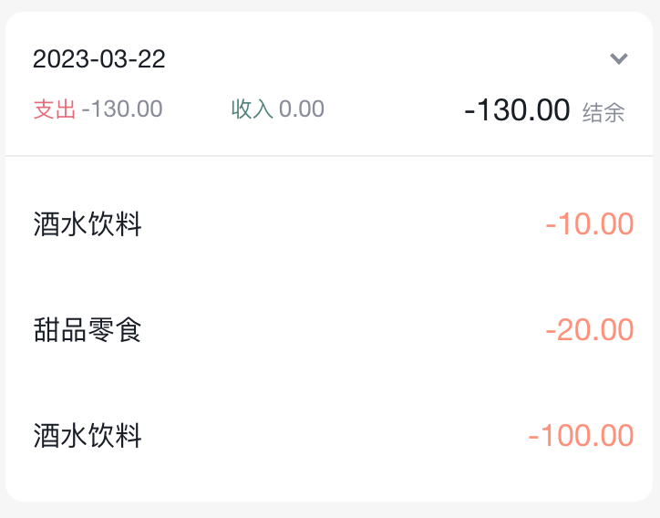

```jsx
// 声明状态
const [visible, setVisible] = useState(false)

// 控制箭头
 <span 
   className={classNames('arrow', !visible && 'expand')} 
   onClick={() => setVisible(!visible)}></span>
     
// 控制列表显示
<div className="billList" style={{ display: !visible && 'none' }}></div>
```

## 月度账单-Icon组件封装


### 1. 准备静态结构

```jsx
const Icon = () => {
  return (
    
  )
}

export default Icon
```

### 2. 设计参数

```jsx
const BASE_URL = 'https://yjy-teach-oss.oss-cn-beijing.aliyuncs.com/reactbase/ka/'

const Icon = ({ type }) => {
  return (
    
  )
}

export default Icon
```

### 3. 使用组件

```jsx
<div className="billList" style={{ display: visible ? 'block' : 'none' }}>
    {billList.map(item => {
      return (
        <div className="bill" key={item.id}>
          <Icon type={item.useFor} />
        </div>
      )
    })}
  </div>
```

## 记账功能

### 记账 - 结构渲染

```jsx
import { Button, DatePicker, Input, NavBar } from 'antd-mobile'
import Icon from '@/components/Icon'
import './index.scss'
import classNames from 'classnames'
import { billListData } from '@/contants'
import { useNavigate } from 'react-router-dom'

const New = () => {
  const navigate = useNavigate()
  return (
    <div className="keepAccounts">
      <NavBar className="nav" onBack={() => navigate(-1)}>
        记一笔
      </NavBar>

      <div className="header">
        <div className="kaType">
          <Button
            shape="rounded"
            className={classNames('selected')}
          >
            支出
          </Button>
          <Button
            className={classNames('')}
            shape="rounded"
          >
            收入
          </Button>
        </div>

        <div className="kaFormWrapper">
          <div className="kaForm">
            <div className="date">
              <Icon type="calendar" className="icon" />
              <span className="text">{'今天'}</span>
              <DatePicker
                className="kaDate"
                title="记账日期"
                max={new Date()}
              />
            </div>
            <div className="kaInput">
              <Input
                className="input"
                placeholder="0.00"
                type="number"
              />
              <span className="iconYuan">¥</span>
            </div>
          </div>
        </div>
      </div>

      <div className="kaTypeList">
        {billListData['pay'].map(item => {
          return (
            <div className="kaType" key={item.type}>
              <div className="title">{item.name}</div>
              <div className="list">
                {item.list.map(item => {
                  return (
                    <div
                      className={classNames(
                        'item',
                        ''
                      )}
                      key={item.type}

                    >
                      <div className="icon">
                        <Icon type={item.type} />
                      </div>
                      <div className="text">{item.name}</div>
                    </div>
                  )
                })}
              </div>
            </div>
          )
        })}
      </div>

      <div className="btns">
        <Button className="btn save">
          保 存
        </Button>
      </div>
    </div>
  )
}

export default New
```

配套样式

```css
.keepAccounts {
  --ka-bg-color: #daf2e1;
  --ka-color: #69ae78;
  --ka-border-color: #191d26;

  height: 100%;
  background-color: var(--ka-bg-color);

  .nav {
    --adm-font-size-10: 16px;
    color: #121826;
    background-color: transparent;
    &::after {
      height: 0;
    }

    .adm-nav-bar-back-arrow {
      font-size: 20px;
    }
  }

  .header {
    height: 132px;

    .kaType {
      padding: 9px 0;
      text-align: center;

      .adm-button {
        --adm-font-size-9: 13px;

        &:first-child {
          margin-right: 10px;
        }
      }
      .selected {
        color: #fff;
        --background-color: var(--ka-border-color);
      }
    }

    .kaFormWrapper {
      padding: 10px 22.5px 20px;

      .kaForm {
        display: flex;
        padding: 11px 15px 11px 12px;
        border: 0.5px solid var(--ka-border-color);
        border-radius: 9px;
        background-color: #fff;

        .date {
          display: flex;
          align-items: center;
          height: 28px;
          padding: 5.5px 5px;
          border-radius: 4px;
          // color: #4f825e;
          color: var(--ka-color);
          background-color: var(--ka-bg-color);

          .icon {
            margin-right: 6px;
            font-size: 17px;
          }
          .text {
            font-size: 16px;
          }
        }

        .kaInput {
          flex: 1;
          display: flex;
          align-items: center;

          .input {
            flex: 1;
            margin-right: 10px;
            --text-align: right;
            --font-size: 24px;
            --color: var(--ka-color);
            --placeholder-color: #d1d1d1;
          }

          .iconYuan {
            font-size: 24px;
          }
        }
      }
    }
  }

  .container {
  }
  .kaTypeList {
    height: 490px;
    padding: 20px 11px;
    padding-bottom: 70px;
    overflow-y: scroll;
    background: #ffffff;
    border-radius: 20px 20px 0 0;
    -ms-overflow-style: none; /* Internet Explorer 10+ */
    scrollbar-width: none; /* Firefox */
    &::-webkit-scrollbar {
      display: none; /* Safari and Chrome */
    }

    .kaType {
      margin-bottom: 25px;
      font-size: 12px;
      color: #333;

      .title {
        padding-left: 5px;
        margin-bottom: 5px;
        font-size: 13px;
        color: #808080;
      }
      .list {
        display: flex;

        .item {
          width: 65px;
          height: 65px;
          padding: 9px 0;
          margin-right: 7px;
          text-align: center;
          border: 0.5px solid #fff;
          &:last-child {
            margin-right: 0;
          }

          .icon {
            height: 25px;
            line-height: 25px;
            margin-bottom: 5px;
            font-size: 25px;
          }
        }
        .item.selected {
          border: 0.5px solid var(--ka-border-color);
          border-radius: 5px;
          background: var(--ka-bg-color);
        }
      }
    }
  }

  .btns {
    position: fixed;
    bottom: 15px;
    width: 100%;
    text-align: center;

    .btn {
    width: 200px;
    --border-width: 0;
    --background-color: #fafafa;
    --text-color: #616161;
    &:first-child {
    margin-right: 15px;
    }
    }
    .btn.save {
    --background-color: var(--ka-bg-color);
    --text-color: var(--ka-color);
    }
    }
  }

```

## 记账 - 支出和收入切换

```jsx
const new = ()=>{
  // 1. 区分账单状态
  const [billType, setBillType] = useState('income')
  return (
     <div className="keepAccounts">
      <div className="kaType">
        {/* 2. 点击切换状态 */}
        <Button
          shape="rounded"
          className={classNames(billType==='pay'?'selected':'')}
          onClick={() => setBillType('pay')}
        >
          支出
        </Button>
        <Button
          className={classNames(billType==='income'?'selected':'')}
          onClick={() => setBillType('income')}
          shape="rounded"
        >
          收入
        </Button>
      </div>
      {/* 2. 适配数据 */}
      <div className="kaTypeList">
          {billListData[billType].map(item => {
            
          })}
      </div>
    </div>
  )
}
```

### 记账 - 新增一笔

```jsx
import { useDispatch } from 'react-redux'

const New = () => {
  // 收集金额
  const [money, setMoney] = useState(0)
  const moneyChange = (value) => {
    setMoney(value)
  }

  // 收集账单类型
  const [useFor, setUseFor] = useState('')
  const dispatch = useDispatch()
  // 保存账单
  const saveBill = () => {
    // 收集表单数据
    const data = {
      type: billType,
      money: billType === 'pay' ? -money : +money,
      date: new Date(),
      useFor: useFor
    }
    console.log(data)
    dispatch(addBillList(data))
  }
  return (
    <div className="keepAccounts">
      <NavBar className="nav" onBack={() => navigate(-1)}>
        记一笔
      </NavBar>

      <div className="header">
        <div className="kaType">
          <Button
            shape="rounded"
            className={classNames(billType === 'pay' ? 'selected' : '')}
            onClick={() => setBillType('pay')}
          >
            支出
          </Button>
          <Button
            className={classNames(billType === 'income' ? 'selected' : '')}
            shape="rounded"
            onClick={() => setBillType('income')}
          >
            收入
          </Button>
        </div>

        <div className="kaFormWrapper">
          <div className="kaForm">
            <div className="date">
              <Icon type="calendar" className="icon" />
              <span className="text">{'今天'}</span>
              <DatePicker
                className="kaDate"
                title="记账日期"
                max={new Date()}
              />
            </div>
            <div className="kaInput">
              <Input
                className="input"
                placeholder="0.00"
                type="number"
                value={money}
                onChange={moneyChange}
              />
              <span className="iconYuan">¥</span>
            </div>
          </div>
        </div>
      </div>

      <div className="kaTypeList">
        {/* 数据区域 */}
        {billListData[billType].map(item => {
          return (
            <div className="kaType" key={item.type}>
              <div className="title">{item.name}</div>
              <div className="list">
                {item.list.map(item => {
                  return (
                    <div
                      className={classNames(
                        'item',
                        ''
                      )}
                      key={item.type}
                      onClick={() => setUseFor(item.type)}
                    >
                      <div className="icon">
                        <Icon type={item.type} />
                      </div>
                      <div className="text">{item.name}</div>
                    </div>
                  )
                })}
              </div>
            </div>
          )
        })}
      </div>

      <div className="btns">
        <Button className="btn save" onClick={saveBill}>
          保 存
        </Button>
      </div>
    </div>
  )
}

export default New
```


# 项目

## 项目搭建

### 基于CRA创建项目

> CRA是一个底层基于webpack快速创建React项目的脚手架工具

```bash
# 使用npx创建项目
npx create-react-app react-jike

# 进入到项
cd react-jike

# 启动项目
npm start
```


### 调整项目目录结构 

```bash
-src
  -apis           项目接口函数
  -assets         项目资源文件，比如，图片等
  -components     通用组件
  -pages          页面组件
  -store          集中状态管理
  -utils          工具，比如，token、axios 的封装等
  -App.js         根组件
  -index.css      全局样式
  -index.js       项目入口
```

`src/index.js`

```jsx
import React from 'react'
import ReactDOM from 'react-dom/client'
import './index.scss'
import './App.js'

ReactDOM.createRoot(document.getElementById('root')).render(
  <React.StrictMode>
    <App/>
  </React.StrictMode>
)
```

`src/App.js`

```jsx
const App = () => {
  return <div>this is app</div>
}

export default App
```

### 使用scss预处理器

> `SASS` 是一种预编译的 CSS，支持一些比较高级的语法，可以提高编写样式的效率，CRA接入scss非常简单只需要我们装一个sass工具


**实现步骤**

1.  安装解析 sass 的包：`npm i sass -D` 
2.  创建全局样式文件：`index.scss` 

```css
body {
  margin: 0;
  div {
    color: blue;
  }
}
```

### 组件库antd使用

> 我们的项目是一个传统的PC管理后台，有现成的组件库可以使用，帮助我们提升开发效率，其中使用最广的就是antD

[Ant Design of React - Ant Design](https://ant.design/docs/react/introduce-cn)
**实现步骤**

1. 安装 antd 组件库：`npm i antd`
2. 导入 Button 组件
3. 在 Login 页面渲染 Button 组件进行测试

**测试Button**
`pages/Login/index.jsx`

```jsx
import { Button } from 'antd'

const Login = () => {
  return <div>this is login<Button type='primary'>test</Button></div>
}
export default Login
```

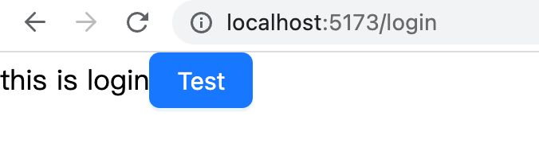

### 配置基础路由

> 单页应用需要对应的路由支持，我们使用 `react-router-dom` 最新版本

**实现步骤**

1. 安装路由包  `npm i react-router-dom`
2. 准备 `Layout`和 `Login`俩个基础组件
3. 配置路由

**代码实现**
`pages/Layout/index.js`

```jsx
const Layout = () => {
  return <div>this is layout</div>
}
export default Layout
```

`pages/Login/index.js`

```jsx
const Login = () => {
  return <div>this is login</div>
}
export default Login
```

`router/index.js`

```jsx
import { createBrowserRouter } from 'react-router-dom'

import Login from '../pages/Login'
import Layout from '../pages/Layout'

const router = createBrowserRouter([
  {
    path: '/',
    element: <Layout />,
  },
  {
    path: '/login',
    element: <Login />,
  },
])

export default router
```

`index.js`

```jsx
import React from 'react'
import ReactDOM from 'react-dom/client'
import './index.scss'
import router from './router'
import { RouterProvider } from 'react-router-dom'

ReactDOM.createRoot(document.getElementById('root')).render(
    <RouterProvider router={router} />
)
```

### 配置别名路径

> 项目背景：在业务开发过程中文件夹的嵌套层级可能会比较深，通过传统的路径选择会比较麻烦也容易出错，设置路径别名可以简化这个过程

路径编译配置

1. 安装 `craco` 工具包
2. 增加 `craco.config.js` 配置文件
3. 修改 `scripts 命令`
4. 测试是否生效

```bash
npm i @craco/craco -D
```

```javascript
const path = require('path')

module.exports = {
  // webpack 配置
  webpack: {
    // 配置别名
    alias: {
      // 约定：使用 @ 表示 src 文件所在路径
      '@': path.resolve(__dirname, 'src')
    }
  }
}
```

```json
"scripts": {
  "start": "craco start",
  "build": "craco build",
  "test": "craco test",
  "eject": "react-scripts eject"
}
```

```javascript
import { createBrowserRouter } from 'react-router-dom'

import Login from '@/pages/Login'
import Layout from '@/pages/Layout'

const router = createBrowserRouter([
  {
    path: '/',
    element: <Layout />,
  },
  {
    path: '/login',
    element: <Login />,
  },
])

export default router
```

### VsCode提示配置

**实现步骤**

1. 在项目根目录创建 `jsconfig.json` 配置文件
2. 在配置文件中添加以下配置

**代码实现**

```json
{
  "compilerOptions": {
    "baseUrl": "./",
    "paths": {
      "@/*": ["src/*"]
    }
  }
}
```

:::warning
说明：VSCode会自动读取`jsconfig.json` 中的配置，让vscode知道@就是src目录
:::

### 使用gitee管理项目


## 登录模块

### 基本结构搭建


**实现步骤**

1. 在 `Login/index.js` 中创建登录页面基本结构
2. 在 Login 目录中创建 index.scss 文件，指定组件样式
3. 将 `logo.png` 和 `login.png` 拷贝到 assets 目录中

**代码实现**
`pages/Login/index.js`

```jsx
import './index.scss'
import { Card, Form, Input, Button } from 'antd'
import logo from '@/assets/logo.png'

const Login = () => {
  return (
    <div className="login">
      <Card className="login-container">
        
        {/* 登录表单 */}
        <Form>
          <Form.Item>
            <Input size="large" placeholder="请输入手机号" />
          </Form.Item>
          <Form.Item>
            <Input size="large" placeholder="请输入验证码" />
          </Form.Item>
          <Form.Item>
            <Button type="primary" htmlType="submit" size="large" block>
              登录
            </Button>
          </Form.Item>
        </Form>
      </Card>
    </div>
  )
}

export default Login
```

`pages/Login/index.scss`

```css
.login {
  width: 100%;
  height: 100%;
  position: absolute;
  left: 0;
  top: 0;
  background: center/cover url('~@/./assets/day6_login.png');

  .login-logo {
    width: 200px;
    height: 60px;
    display: block;
    margin: 0 auto 20px;
  }

  .login-container {
    width: 440px;
    height: 360px;
    position: absolute;
    left: 50%;
    top: 50%;
    transform: translate(-50%, -50%);
    box-shadow: 0 0 50px rgb(0 0 0 / 10%);
  }

  .login-checkbox-label {
    color: #1890ff;
  }
}

```

### 表单校验实现


**实现步骤**

1. 为 Form 组件添加 `validateTrigger` 属性，指定校验触发时机的集合
2. **为 Form.Item 组件添加 name 属性**
3. 为 Form.Item 组件添加 `rules` 属性，用来添加表单校验规则对象

**代码实现**
`page/Login/index.js`

```jsx
const Login = () => {
  return (
    <Form validateTrigger={['onBlur']}>
      <Form.Item
        name="mobile"
        rules={[
          { required: true, message: '请输入手机号' },
          {
            pattern: /^1[3-9]\d{9}$/,
            message: '手机号码格式不对'
          }
        ]}
      >
        <Input size="large" placeholder="请输入手机号" />
      </Form.Item>
      <Form.Item
        name="code"
        rules={[
          { required: true, message: '请输入验证码' },
        ]}
      >
        <Input size="large" placeholder="请输入验证码" maxLength={6} />
      </Form.Item>
    
      <Form.Item>
        <Button type="primary" htmlType="submit" size="large" block>
          登录
        </Button>
      </Form.Item>
    </Form>
  )
}
```

### 获取登录表单数据

**实现步骤**

1. 为 Form 组件添加 `onFinish` 属性，该事件会在点击登录按钮时触发
2. 创建 onFinish 函数，通过函数参数 values 拿到表单值
3. Form 组件添加 `initialValues` 属性，来初始化表单值

**代码实现**
`pages/Login/index.js`

```jsx
// 点击登录按钮时触发 参数values即是表单输入数据
const onFinish = formValue => {
  console.log(formValue)
}

<Form
  onFinish={ onFinish }
>...</Form>
```

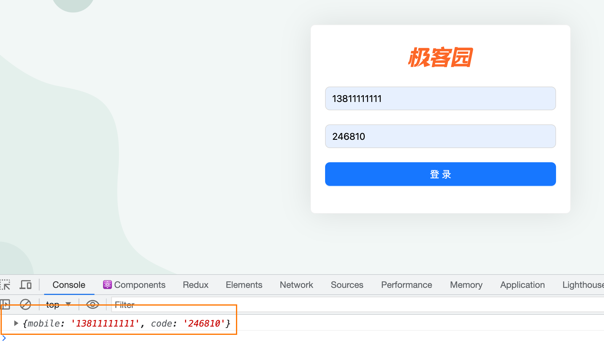

### 封装request工具模块

> 业务背景: 前端需要和后端拉取接口数据，axios是使用最广的工具插件，针对于项目中的使用，我们需要做一些简单的封装


**实现步骤**

1. 安装 axios 到项目  
2. 创建 utils/request.js 文件
3. 创建 axios 实例，配置 `baseURL，请求拦截器，响应拦截器` 
4. 在 utils/index.js 中，统一导出request

```bash
npm i axios
```

```javascript
import axios from 'axios'

const http = axios.create({
  baseURL: 'http://geek.itheima.net/v1_0',
  timeout: 5000
})

// 添加请求拦截器
http.interceptors.request.use((config)=> {
    return config
  }, (error)=> {
    return Promise.reject(error)
})

// 添加响应拦截器
http.interceptors.response.use((response)=> {
    // 2xx 范围内的状态码都会触发该函数。
    // 对响应数据做点什么
    return response.data
  }, (error)=> {
    // 超出 2xx 范围的状态码都会触发该函数。
    // 对响应错误做点什么
    return Promise.reject(error)
})

export { http }
```

```javascript
import { request } from './request'
export { request }
```

[Axios](https://axios-http.com/zh/)

### 使用Redux管理token

#### 安装Redux相关工具包

```bash
npm i react-redux @reduxjs/toolkit
```

#### 配置Redux

```javascript
import { createSlice } from '@reduxjs/toolkit'
import { http } from '@/utils'
const userStore = createSlice({
  name: 'user',
  // 数据状态
  initialState: {
    token:''
  },
  // 同步修改方法
  reducers: {
    setUserInfo (state, action) {
      state.userInfo = action.payload
    }
  }
})

// 解构出actionCreater
const { setUserInfo } = userStore.actions

// 获取reducer函数
const userReducer = userStore.reducer

// 异步方法封装
const fetchLogin = (loginForm) => {
  return async (dispatch) => {
    const res = await http.post('/authorizations', loginForm)
    dispatch(setUserInfo(res.data.token))
  }
}

export { fetchLogin }

export default userReducer
```

```javascript
import { configureStore } from '@reduxjs/toolkit'

import userReducer from './modules/user'

export default configureStore({
  reducer: {
    // 注册子模块
    user: userReducer
  }
})
```

### 实现登录逻辑

> 业务逻辑：
>
> 1. 跳转到首页
> 2. 提示用户登录成功

```jsx
import { message } from 'antd'
import useStore from '@/store'
import { fetchLogin } from '@/store/modules/user'
import { useDispatch } from 'react-redux'

const Login = () => {
  const dispatch = useDispatch()
  const navigate = useNavigate()
  const onFinish = async formValue => {
    await dispatch(fetchLogin(formValue))
    navigate('/')
    message.success('登录成功')
  }
  return (
    <div className="login">
     <!-- 省略... -->
    </div>
  )
}

export default Login
```


13800000002

246810

### token持久化

> 业务背景: Token数据具有一定的时效时间，通常在几个小时，有效时间内无需重新获取，而基于Redux的存储方式又是基于内存的，刷新就会丢失，为了保持持久化，我们需要单独做处理

#### 封装存取方法

```javascript
// 封装存取方法

const TOKEN_KEY = 'token_key'

function setToken (token) {
    return localStorage.setItem(TOKEN_KEY, token)
}

function getToken () {
    return localStorage.getItem(TOKEN_KEY)
}

function removeToken() {
    return localStorage.removeItem(TOKEN_KEY)
}

export {
    setToken,
    getToken,
    removeToken
}

```

#### 实现持久化逻辑

```javascript
import { getToken, setToken } from '@/utils'
const userStore = createSlice({
  name: 'user',
  // 数据
  initialState: {
    token: getToken() || ''
  },
  // 同步修改方法
  reducers: {
    setUserInfo (state, action) {
      state.token = action.payload
      // 存入本地
      setToken(state.token)
    }
  }
})
```

刷新浏览器，通过Redux调试工具查看token数据


### 请求拦截器注入token

> 业务背景: Token作为用户的数据标识，在接口层面起到了接口权限控制的作用，也就是说后端有很多接口都需要通过查看当前请求头信息中是否含有token数据，来决定是否正常返回数据

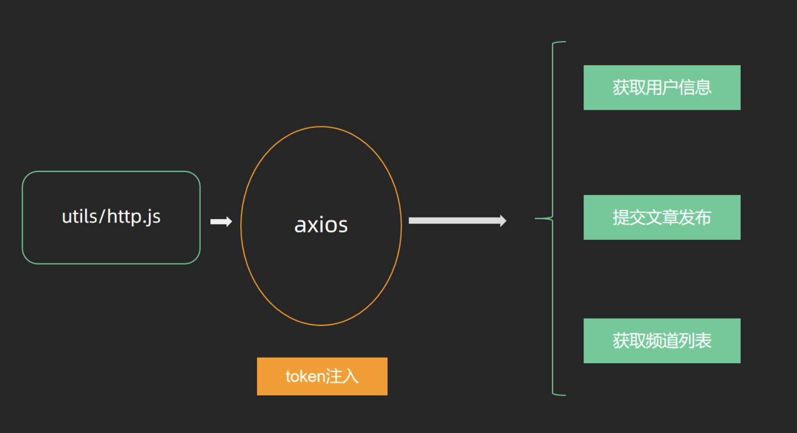

> 拼接方式：config.headers.Authorization = `Bearer ${token}}`


`utils/request.js`

```javascript
// 添加请求拦截器
request.interceptors.request.use(config => {
  // if not login add token
  const token = getToken()
  if (token) {
    config.headers.Authorization = `Bearer ${token}`
  }
  return config
})
```

### 路由鉴权实现

> 业务背景：封装 `AuthRoute` 路由鉴权高阶组件，实现未登录拦截，并跳转到登录页面
> 实现思路：判断本地是否有token，如果有，就返回子组件，否则就重定向到登录Login


**实现步骤**

1. 在 components 目录中，创建 `AuthRoute/index.jsx` 文件
2. 登录时，直接渲染相应页面组件
3. 未登录时，重定向到登录页面
4. 将需要鉴权的页面路由配置，替换为 AuthRoute 组件渲染

**代码实现**
`components/AuthRoute/index.jsx`

```jsx
import { getToken } from '@/utils'
import { Navigate } from 'react-router-dom'

const AuthRoute = ({ children }) => {
  const isToken = getToken()
  if (isToken) {
    return <>{children}</>
  } else {
    return <Navigate to="/login" replace />
  }
}

export default AuthRoute
```

`src/router/index.jsx`

```jsx
import { createBrowserRouter } from 'react-router-dom'

import Login from '@/pages/Login'
import Layout from '@/pages/Layout'
import AuthRoute from '@/components/Auth'


const router = createBrowserRouter([
  {
    path: '/',
    element: <AuthRoute><Layout /></AuthRoute>,
  },
  {
    path: '/login',
    element: <Login />,
  },
])

export default router
```

## Layout模块

### 基本结构和样式reset

#### 结构创建


**实现步骤**

1. 打开 `antd/Layout` 布局组件文档，找到示例：顶部-侧边布局-通栏
2. 拷贝示例代码到我们的 Layout 页面中
3. 分析并调整页面布局

**代码实现**
`pages/Layout/index.js`

```jsx
import { Layout, Menu, Popconfirm } from 'antd'
import {
  HomeOutlined,
  DiffOutlined,
  EditOutlined,
  LogoutOutlined,
} from '@ant-design/icons'
import './index.scss'

const { Header, Sider } = Layout

const items = [
  {
    label: '首页',
    key: '1',
    icon: <HomeOutlined />,
  },
  {
    label: '文章管理',
    key: '2',
    icon: <DiffOutlined />,
  },
  {
    label: '创建文章',
    key: '3',
    icon: <EditOutlined />,
  },
]

const GeekLayout = () => {
  return (
    <Layout>
      <Header className="header">
        <div className="logo" />
        <div className="user-info">
          <span className="user-name">柴柴老师</span>
          <span className="user-logout">
            <Popconfirm title="是否确认退出？" okText="退出" cancelText="取消">
              <LogoutOutlined /> 退出
            </Popconfirm>
          </span>
        </div>
      </Header>
      <Layout>
        <Sider width={200} className="site-layout-background">
          <Menu
            mode="inline"
            theme="dark"
            defaultSelectedKeys={['1']}
            items={items}
            style={{ height: '100%', borderRight: 0 }}></Menu>
        </Sider>
        <Layout className="layout-content" style={{ padding: 20 }}>
          内容
        </Layout>
      </Layout>
    </Layout>
  )
}
export default GeekLayout
```

`pages/Layout/index.scss`

```css
.ant-layout {
  height: 100%;
}

.header {
  padding: 0;
}

.logo {
  width: 200px;
  height: 60px;
  background: url('~@/./assets/day6_logo.png') no-repeat center / 160px auto;
}

.layout-content {
  overflow-y: auto;
}

.user-info {
  position: absolute;
  right: 0;
  top: 0;
  padding-right: 20px;
  color: #fff;
  
  .user-name {
    margin-right: 20px;
  }
  
  .user-logout {
    display: inline-block;
    cursor: pointer;
  }
}
.ant-layout-header {
  padding: 0 !important;
}
```

### 样式reset

```bash
npm install normalize.css
```

```css
html,
body {
  margin: 0;
  height: 100%;
}

#root {
  height: 100%;
}
```

### 二级路由配置

**使用步骤**

1. 在 pages 目录中，分别创建：Home（数据概览）/Article（内容管理）/Publish（发布文章）页面文件夹
2. 分别在三个文件夹中创建 index.jsx 并创建基础组件后导出
3. 在`router/index.js` 中配置嵌套子路由，在`Layout`中配置二级路由出口
4. 使用 Link 修改左侧菜单内容，与子路由规则匹配实现路由切换

**代码实现**
`pages/Home/index.js`

```jsx
const Home = () => {
  return <div>Home</div>
}
export default Home
```

`pages/Article/index.js`

```jsx
const Article = () => {
  return <div>Article</div>
}
export default Article
```

`pages/Publish/index.js`

```jsx
const Publish = () => {
  return <div>Publish</div>
}
export default Publish
```

`router/index.js`

```jsx
import { createBrowserRouter } from 'react-router-dom'

import Login from '@/pages/Login'
import Layout from '@/pages/Layout'
import Publish from '@/pages/Publish'
import Article from '@/pages/Article'
import Home from '@/pages/Home'
import { AuthRoute } from '@/components/Auth'

const router = createBrowserRouter([
  {
    path: '/',
    element: (
      <AuthRoute>
        <Layout />
      </AuthRoute>
    ),
    children: [
      {
        index: true,
        element: <Home />,
      },
      {
        path: 'article',
        element: <Article />,
      },
      {
        path: 'publish',
        element: <Publish />,
      },
    ],
  },
  {
    path: '/login',
    element: <Login />,
  },
])

export default router
```

配置二级路由出口

```jsx
<Layout className="layout-content" style={{ padding: 20 }}>
  <Outlet />
</Layout>
```

### 路由菜单点击交互实现


#### 点击菜单跳转路由

```jsx
import { Outlet, useNavigate } from 'react-router-dom'

const items = [
  {
    label: '首页',
    key: '/',
    icon: <HomeOutlined />,
  },
  {
    label: '文章管理',
    key: '/article',
    icon: <DiffOutlined />,
  },
  {
    label: '创建文章',
    key: '/publish',
    icon: <EditOutlined />,
  },
]

const GeekLayout = () => {
  const navigate = useNavigate()
  const menuClick = (route) => {
    navigate(route.key)
  }
  return (
      <Menu
        mode="inline"
        theme="dark"
        selectedKeys={selectedKey}
        items={items}
        style={{ height: '100%', borderRight: 0 }}
        onClick={menuClick}
      /> 
  )
}
export default GeekLayout
```

#### 菜单反向高亮

```tsx
const GeekLayout = () => {
  // 省略部分代码
  const location = useLocation()
  const selectedKey = location.pathname
  
  return (
    <Layout>
      <Header className="header">
        <div className="logo" />
        <div className="user-info">
          <span className="user-name">{name}</span>
          <span className="user-logout">
            <Popconfirm title="是否确认退出？" okText="退出" cancelText="取消">
              <LogoutOutlined /> 退出
            </Popconfirm>
          </span>
        </div>
      </Header>
      <Layout>
        <Sider width={200} className="site-layout-background">
          <Menu
            mode="inline"
            theme="dark"
            selectedKeys={selectedKey}
            items={items}
            style={{ height: '100%', borderRight: 0 }}
            onClick={menuClickHandler}></Menu>
        </Sider>
        <Layout className="layout-content" style={{ padding: 20 }}>
          <Outlet />
        </Layout>
      </Layout>
    </Layout>
  )
}
```

### 展示个人信息


**实现步骤**

1. 在Redux的store中编写获取用户信息的相关逻辑
2. 在Layout组件中触发action的执行
3. 在Layout组件使用使用store中的数据进行用户名的渲染

**代码实现**
`store/userStore.js`

```javascript
import { createSlice } from '@reduxjs/toolkit'
import { http } from '@/utils/request'
import { getToken, setToken } from '@/utils'
const userStore = createSlice({
  name: 'user',
  // 数据
  initialState: {
    token: getToken() || '',
    userInfo: {}
  },
  // 同步修改方法
  reducers: {
    setUserToken (state, action) {
      state.token = action.payload
      // 存入本地
      setToken(state.token)
    },
    setUserInfo (state, action) {
      state.userInfo = action.payload
    }
  }
})

// 解构出actionCreater
const { setUserToken, setUserInfo } = userStore.actions

// 获取reducer函数
const userReducer = userStore.reducer

const fetchLogin = (loginForm) => {
  return async (dispatch) => {
    const res = await http.post('/authorizations', loginForm)
    dispatch(setUserToken(res.data.token))
  }
}


const fetchUserInfo = () => {
  return async (dispatch) => {
    const res = await http.get('/user/profile')
    dispatch(setUserInfo(res.data))
  }
}

export { fetchLogin, fetchUserInfo }

export default userReducer
```

`pages/Layout/index.js`

```jsx
// 省略部分代码
import { fetchUserInfo } from '@/store/modules/user'
import { useDispatch, useSelector } from 'react-redux'


const GeekLayout = () => {
  const dispatch = useDispatch()
  const name = useSelector(state => state.user.userInfo.name)
  useEffect(() => {
    dispatch(fetchUserInfo())
  }, [dispatch])
  return (
    <Layout>
      <Header className="header">
        <div className="logo" />
        <div className="user-info">
          <span className="user-name">{name}</span>
          <span className="user-logout">
            <Popconfirm title="是否确认退出？" okText="退出" cancelText="取消">
              <LogoutOutlined /> 退出
            </Popconfirm>
          </span>
        </div>
      </Header>
      <Layout>
        <Sider width={200} className="site-layout-background">
          <Menu
            mode="inline"
            theme="dark"
            defaultSelectedKeys={['1']}
            items={items}
            style={{ height: '100%', borderRight: 0 }}></Menu>
        </Sider>
        <Layout className="layout-content" style={{ padding: 20 }}>
          <Outlet />
        </Layout>
      </Layout>
    </Layout>
  )
}
export default GeekLayout
```

### 退出登录实现


**实现步骤**

1. 为气泡确认框添加确认回调事件
2. 在`store/userStore.js` 中新增退出登录的action函数，在其中删除token
3. 在回调事件中，调用userStore中的退出action
4. 清除用户信息，返回登录页面

**代码实现**
`store/modules/user.js`

```javascript
import { createSlice } from '@reduxjs/toolkit'
import { http } from '@/utils/request'
import { clearToken, getToken, setToken } from '@/utils'
const userStore = createSlice({
  name: 'user',
  // 数据
  initialState: {
    token: getToken() || '',
    userInfo: {}
  },
  // 同步修改方法
  reducers: {
    setUserToken (state, action) {
      state.token = action.payload
      // 存入本地
      setToken(state.token)
    },
    setUserInfo (state, action) {
      state.userInfo = action.payload
    },
    clearUserInfo (state) {
      state.token = ''
      state.userInfo = {}
      clearToken()
    }
  }
})

// 解构出actionCreater
const { setUserToken, setUserInfo, clearUserInfo } = userStore.actions

// 获取reducer函数
const userReducer = userStore.reducer


export { fetchLogin, fetchUserInfo, clearUserInfo }

export default userReducer
```

`pages/Layout/index.js`

```jsx
const GeekLayout = () => {
  // 退出登录
  const loginOut = () => {
    dispatch(clearUserInfo())
    navigator('/login')
  }

  return (
    <Layout>
      <Header className="header">
        <div className="logo" />
        <div className="user-info">
          <span className="user-name">{name}</span>
          <span className="user-logout">
            <Popconfirm 
              title="是否确认退出？" 
              okText="退出" 
              cancelText="取消" 
              onConfirm={loginOut}>
              <LogoutOutlined /> 退出
            </Popconfirm>
          </span>
        </div>
      </Header>
      <Layout>
        <Sider width={200} className="site-layout-background">
          <Menu
            mode="inline"
            theme="dark"
            selectedKeys={selectedKey}
            items={items}
            style={{ height: '100%', borderRight: 0 }}
            onClick={menuClickHandler}></Menu>
        </Sider>
        <Layout className="layout-content" style={{ padding: 20 }}>
          <Outlet />
        </Layout>
      </Layout>
    </Layout>
  )
}
```


### 处理Token失效

> 业务背景：如果用户一段时间不做任何操作，到时之后应该清除所有过期用户信息跳回到登录


```javascript
http.interceptors.response.use((response) => {
  // 2xx 范围内的状态码都会触发该函数。
  // 对响应数据做点什么
  return response.data
}, (error) => {
  // 超出 2xx 范围的状态码都会触发该函数。
  // 对响应错误做点什么
  console.dir(error)
  if (error.response.status === 401) {
    clearToken()
    router.navigate('/login')
    window.location.reload()
  }

  return Promise.reject(error)
})
```

### 首页Home图表展示


#### 图表基础Demo实现

> 图表类业务渲染，我们可以通过下面的顺序来实现
>
> 1. 跑通基础DEMO
> 2. 按照实际业务需求进行修改


**安装echarts**

```bash
npm i echarts
```

**实现基础Demo**

```jsx
import { useEffect, useRef } from 'react'
import * as echarts from 'echarts'

const Home = () => {
  const chartRef = useRef(null)
  useEffect(() => {
    // 1. 生成实例
    const myChart = echarts.init(chartRef.current)
    // 2. 准备图表参数
    const option = {
      xAxis: {
        type: 'category',
        data: ['Mon', 'Tue', 'Wed', 'Thu', 'Fri', 'Sat', 'Sun']
      },
      yAxis: {
        type: 'value'
      },
      series: [
        {
          data: [120, 200, 150, 80, 70, 110, 130],
          type: 'bar'
        }
      ]
    }
    // 3. 渲染参数
    myChart.setOption(option)
  }, [])

  return (
    <div>
      <div ref={chartRef} style={{ width: '400px', height: '300px' }} />
    </div >
  )
}

export default Home
```

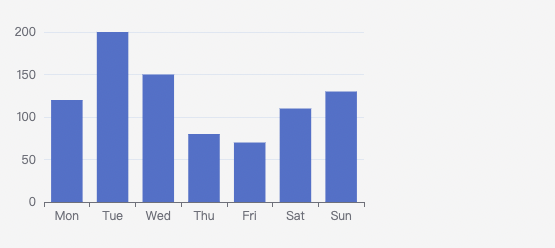

#### 组件封装

基础抽象

```jsx
import { useRef, useEffect } from 'react'
import * as echarts from 'echarts'

const BarChart = () => {
  const chartRef = useRef(null)
  useEffect(() => {
    // 1. 生成实例
    const myChart = echarts.init(chartRef.current)
    // 2. 准备图表参数
    const option = {
      xAxis: {
        type: 'category',
        data: ['Mon', 'Tue', 'Wed', 'Thu', 'Fri', 'Sat', 'Sun']
      },
      yAxis: {
        type: 'value'
      },
      series: [
        {
          data: [120, 200, 150, 80, 70, 110, 130],
          type: 'bar'
        }
      ]
    }
    // 3. 渲染参数
    myChart.setOption(option)
  }, [])
  return <div ref={chartRef} style={{ width: '400px', height: '300px' }}></div>
}

export { BarChart }
```

抽象可变参数

```tsx
import { useRef, useEffect } from 'react'
import * as echarts from 'echarts'

const BarChart = ({ xData, sData, style = { width: '400px', height: '300px' } }) => {
  const chartRef = useRef(null)
  useEffect(() => {
    // 1. 生成实例
    const myChart = echarts.init(chartRef.current)
    // 2. 准备图表参数
    const option = {
      xAxis: {
        type: 'category',
        data: xData
      },
      yAxis: {
        type: 'value'
      },
      series: [
        {
          data: sData,
          type: 'bar'
        }
      ]
    }
    // 3. 渲染参数
    myChart.setOption(option)
  }, [sData, xData])
  return <div ref={chartRef} style={style}></div>
}

export { BarChart }
```

```jsx
import { BarChart } from './BarChart'

const Home = () => {
  return (
    <div>
      <BarChart
        xData={['Vue', 'React', 'Angular']}
        sData={[2000, 5000, 1000]} />

      <BarChart
        xData={['Vue', 'React', 'Angular']}
        sData={[200, 500, 100]}
        style={{ width: '500px', height: '400px' }} />
    </div >
  )
}

export default Home
```

## 上传文章模块

### 实现基础文章发布

#### 创建基础结构

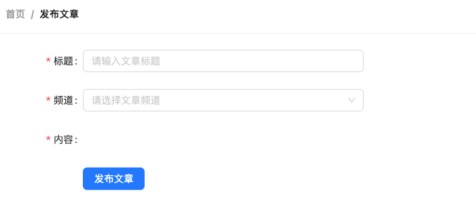

```jsx
import {
  Card,
  Breadcrumb,
  Form,
  Button,
  Radio,
  Input,
  Upload,
  Space,
  Select
} from 'antd'
import { PlusOutlined } from '@ant-design/icons'
import { Link } from 'react-router-dom'
import './index.scss'

const { Option } = Select

const Publish = () => {
  return (
    <div className="publish">
      <Card
        title={
          <Breadcrumb items={[
            { title: <Link to={'/'}>首页</Link> },
            { title: '发布文章' },
          ]}
          />
        }
      >
        <Form
          labelCol={{ span: 4 }}
          wrapperCol={{ span: 16 }}
          initialValues={{ type: 1 }}
        >
          <Form.Item
            label="标题"
            name="title"
            rules={[{ required: true, message: '请输入文章标题' }]}
          >
            <Input placeholder="请输入文章标题" style={{ width: 400 }} />
          </Form.Item>
          <Form.Item
            label="频道"
            name="channel_id"
            rules={[{ required: true, message: '请选择文章频道' }]}
          >
            <Select placeholder="请选择文章频道" style={{ width: 400 }}>
              <Option value={0}>推荐</Option>
            </Select>
          </Form.Item>
          <Form.Item
            label="内容"
            name="content"
            rules={[{ required: true, message: '请输入文章内容' }]}
          ></Form.Item>

          <Form.Item wrapperCol={{ offset: 4 }}>
            <Space>
              <Button size="large" type="primary" htmlType="submit">
                发布文章
              </Button>
            </Space>
          </Form.Item>
        </Form>
      </Card>
    </div>
  )
}

export default Publish
```

`pages/Publish/index.scss`

```css
.publish {
  position: relative;
}

.ant-upload-list {
  .ant-upload-list-picture-card-container,
  .ant-upload-select {
    width: 146px;
    height: 146px;
  }
}
```

#### 准备富文本编辑器

**实现步骤**

1. 安装富文本编辑器 
2. 导入富文本编辑器组件以及样式文件
3. 渲染富文本编辑器组件
4. 调整富文本编辑器的样式

**代码落地**
1-安装 `react-quill`

```bash
npm i react-quill@2.0.0-beta.2
```

2-导入资源渲染组件

```jsx
import ReactQuill from 'react-quill'
import 'react-quill/dist/quill.snow.css'

const Publish = () => {
  return (
    // ...
    <Form
      labelCol={{ span: 4 }}
      wrapperCol={{ span: 16 }}
    >
      <Form.Item
        label="内容"
        name="content"
        rules={[{ required: true, message: '请输入文章内容' }]}
      >
        <ReactQuill
          className="publish-quill"
          theme="snow"
          placeholder="请输入文章内容"
        />
      </Form.Item>
    </Form>
  )
}
```

```css
.publish-quill {
  .ql-editor {
    min-height: 300px;
  }
}
```

#### 频道数据获取


**实现步骤**

1. 使用useState初始化数据和修改数据的方法
2. 在useEffect中调用接口并保存数据
3. 使用数据渲染对应模版

**代码实现**

```jsx
import { http } from '@/utils'

// 频道列表
const [channels, setChannels] = useState([])

// 调用接口
useEffect(() => {
    async function fetchChannels() {
      const res = await http.get('/channels')
      setChannels(res.data.channels)
    }
    fetchChannels()
}, [])

// 模板渲染
return (
 <Form.Item
    label="频道"
    name="channel_id"
    rules={[{ required: true, message: '请选择文章频道' }]}
  >
    <Select placeholder="请选择文章频道" style={{ width: 200 }}>
      {channels.map(item => (
        <Option key={item.id} value={item.id}>
          {item.name}
        </Option>
      ))}
    </Select>
  </Form.Item>
)
```

#### 发布文章

```jsx
// 发布文章
const onFinish = async (formValue) => {
  const { channel_id, content, title } = formValue
  const params = {
    channel_id,
    content,
    title,
    type: 1,
    cover: {
      type: 1,
      images: []
    }
  }
  await http.post('/mp/articles?draft=false', params)
  message.success('发布文章成功')
}
```


### 上传封面实现

#### 准备上传结构


```tsx
<Form.Item label="封面">
  <Form.Item name="type">
    <Radio.Group>
      <Radio value={1}>单图</Radio>
      <Radio value={3}>三图</Radio>
      <Radio value={0}>无图</Radio>
    </Radio.Group>
  </Form.Item>
  <Upload
    listType="picture-card"
    showUploadList
  >
    <div style={{ marginTop: 8 }}>
      <PlusOutlined />
    </div>
  </Upload>
</Form.Item>
```

#### 实现基础上传

**实现步骤**

1. 为 Upload 组件添加 `action 属性`，配置封面图片上传接口地址
2. 为 Upload组件添加 `name属性`, 接口要求的字段名
3. 为 Upload 添加 `onChange 属性`，在事件中拿到当前图片数据，并存储到React状态中

**代码实现**

```jsx
import { useState } from 'react'

const Publish = () => {
  // 上传图片
  const [imageList, setImageList] = useState([])
  const onUploadChange = (info) => {
      setImageList(info.fileList)
  }
  return (
   	<Form.Item label="封面">
      <Form.Item name="type">
        <Radio.Group>
          <Radio value={1}>单图</Radio>
          <Radio value={3}>三图</Radio>
          <Radio value={0}>无图</Radio>
        </Radio.Group>
      </Form.Item>
      <Upload
        name="image"
        listType="picture-card"
        showUploadList
        action={'http://geek.itheima.net/v1_0/upload'}
        onChange={onUploadChange}
      >
        <div style={{ marginTop: 8 }}>
          <PlusOutlined />
        </div>
      </Upload>
    </Form.Item>
  )
}
```

### 切换图片Type

**实现步骤**

1. 点击单选框时拿到当前的类型value
2. 根据value控制上传组件的显示（大于零时才显示）

```jsx
const Publish = ()=>{
  // 控制图片Type
  const [imageType, setImageType] = useState(0)

  const onTypeChange = (e) => {
    console.log(e)
    setImageType(e.target.value)
  }
  
  return (
    <FormItem>
      <Radio.Group onChange={onTypeChange}>
        <Radio value={1}>单图</Radio>
        <Radio value={3}>三图</Radio>
        <Radio value={0}>无图</Radio>
      </Radio.Group>
      {imageType > 0 &&
      <Upload
        name="image"
        listType="picture-card"
        showUploadList
        action={'http://geek.itheima.net/v1_0/upload'}
        onChange={onUploadChange}
        >
        <div style={{ marginTop: 8 }}>
          <PlusOutlined />
        </div>
      </Upload>}
    </FormItem>
  )
}
```


### 控制最大上传图片数量

**实现步骤**

1. 通过 maxCount 属性限制图片的上传图片数量

```jsx
{imageType > 0 &&
<Upload
  name="image"
  listType="picture-card"
  className="avatar-uploader"
  showUploadList
  action={'http://geek.itheima.net/v1_0/upload'}
  onChange={onUploadChange}
  maxCount={imageType}
  multiple={imageType > 1}
>
  <div style={{ marginTop: 8 }}>
    <PlusOutlined />
  </div>
</Upload>}
```

### 暂存图片列表实现

**业务描述**
如果当前为三图模式，已经完成了上传，选择单图只显示一张，再切换到三图继续显示三张，该如何实现？

**实现思路**
在上传完毕之后通过ref存储所有图片，需要几张就显示几张，其实也就是把ref当仓库，用多少拿多少

**实现步骤**

1. 通过useRef创建一个暂存仓库，在上传完毕图片的时候把图片列表存入
2. 如果是单图模式，就从仓库里取第一张图，以**数组的形式**存入fileList
3. 如果是三图模式，就把仓库里所有的图片，以**数组的形式**存入fileList

**代码实现**

```jsx
const Publish = () => {
  // 上传图片
  const cacheImageList = useRef([])
  const [imageList, setImageList] = useState([])
  const onUploadChange = (info) => {
      setImageList(info.fileList)
      cacheImageList.current = info.fileList
  }

  // 控制图片Type
  const [imageType, setImageType] = useState(0)

  const onRadioChange = (e) => {
    const type = e.target.value
    setImageType(type)
    if (type === 1) {
      // 单图，截取第一张展示
      const imgList = cacheImageList.current[0] ? [cacheImageList.current[0]] : []
      setImageList(imgList)
    } else if (type === 3) {
      // 三图，取所有图片展示
      setImageList(cacheImageList.current)
    }
  }

  return (
    {imageType > 0 &&
    <Upload
      name="image"
      listType="picture-card"
      className="avatar-uploader"
      showUploadList
      action={'http://geek.itheima.net/v1_0/upload'}
      onChange={onUploadChange}
      maxCount={imageType}
      multiple={imageType > 1}
      fileList={imageList}
      >
      <div style={{ marginTop: 8 }}>
        <PlusOutlined />
      </div>
    </Upload>}
)
}
```

> 注意：需要给Upload组件添加fileList属性，达成受控的目的


### 发布带封面的文章

#### 校验图片类型和数量是否吻合

```jsx
// 发布文章
  const onFinish = async (formValue) => {
    if (imageType !== imageList.length) return message.warning('图片类型和数量不一致')
    const { channel_id, content, title } = formValue
    const params = {
      channel_id,
      content,
      title,
      type: imageType,
      cover: {
        type: imageType,
        images: imageList.map(item => item.response.data.url)
      }
    }
    await http.post('/mp/articles?draft=false', params)
    message.success('发布文章成功')
  }
```

#### 处理图片列表格式为接口格式

```jsx
// 发布文章
const onFinish = async (formValue) => {
  const { channel_id, content, title } = formValue
  const params = {
    channel_id,
    content,
    title,
    type: imageType,
    cover: {
      type: imageType,
      images: imageList.map(item => item.response.data.url)
    }
  }
  await http.post('/mp/articles?draft=false', params)
  message.success('发布文章成功')
}
```

## 文章列表模块

### 静态结构创建

#### 筛选区结构搭建


> 1.  如何让RangePicker日期范围选择框选择中文 
> 2.  Select组件配合Form.Item使用时，如何配置默认选中项
>     `<Form initialValues={{ status: null }} >` 


**代码实现**

```jsx
import { Link } from 'react-router-dom'
import { Card, Breadcrumb, Form, Button, Radio, DatePicker, Select } from 'antd'
import locale from 'antd/es/date-picker/locale/zh_CN'

const { Option } = Select
const { RangePicker } = DatePicker

const Article = () => {
  return (
    <div>
      <Card
        title={
          <Breadcrumb items={[
            { title: <Link to={'/'}>首页</Link> },
            { title: '文章列表' },
          ]} />
        }
        style={{ marginBottom: 20 }}
      >
        <Form initialValues={{ status: '' }}>
          <Form.Item label="状态" name="status">
            <Radio.Group>
              <Radio value={''}>全部</Radio>
              <Radio value={0}>草稿</Radio>
              <Radio value={2}>审核通过</Radio>
            </Radio.Group>
          </Form.Item>

          <Form.Item label="频道" name="channel_id">
            <Select
              placeholder="请选择文章频道"
              defaultValue="lucy"
              style={{ width: 120 }}
            >
              <Option value="jack">Jack</Option>
              <Option value="lucy">Lucy</Option>
            </Select>
          </Form.Item>

          <Form.Item label="日期" name="date">
            {/* 传入locale属性 控制中文显示*/}
            <RangePicker locale={locale}></RangePicker>
          </Form.Item>

          <Form.Item>
            <Button type="primary" htmlType="submit" style={{ marginLeft: 40 }}>
              筛选
            </Button>
          </Form.Item>
        </Form>
      </Card>
    </div>
  )
}

export default Article
```

#### 表格区域结构


**代码实现**

```jsx
// 导入资源
import { Table, Tag, Space } from 'antd'
import { EditOutlined, DeleteOutlined } from '@ant-design/icons'
import img404 from '@/./assets/error.png'

const Article = () => {
  // 准备列数据
  const columns = [
    {
      title: '封面',
      dataIndex: 'cover',
      width: 120,
      render: cover => {
        return 
      }
    },
    {
      title: '标题',
      dataIndex: 'title',
      width: 220
    },
    {
      title: '状态',
      dataIndex: 'status',
      render: data => <Tag color="green">审核通过</Tag>
    },
    {
      title: '发布时间',
      dataIndex: 'pubdate'
    },
    {
      title: '阅读数',
      dataIndex: 'read_count'
    },
    {
      title: '评论数',
      dataIndex: 'comment_count'
    },
    {
      title: '点赞数',
      dataIndex: 'like_count'
    },
    {
      title: '操作',
      render: data => {
        return (
          <Space size="middle">
            <Button type="primary" shape="circle" icon={<EditOutlined />} />
            <Button
              type="primary"
              danger
              shape="circle"
              icon={<DeleteOutlined />}
            />
          </Space>
        )
      }
    }
  ]
  // 准备表格body数据
  const data = [
    {
      id: '8218',
      comment_count: 0,
      cover: {
        images: [],
      },
      like_count: 0,
      pubdate: '2019-03-11 09:00:00',
      read_count: 2,
      status: 2,
      title: 'wkwebview离线化加载h5资源解决方案'
    }
  ]
  return (
    <div>
      {/*        */}
      <Card title={`根据筛选条件共查询到 count 条结果：`}>
        <Table rowKey="id" columns={columns} dataSource={data} />
      </Card>
    </div>
  )
}
```

### 渲染频道数据

**实现步骤**

1. 使用axios获取数据
2. 将使用频道数据列表改写下拉框组件

**代码实现**
`pages/Article/index.js`

```jsx
const Article = ()=>{
  // 获取频道列表
  const [channels, setChannels] = useState([])
  useEffect(() => {
      async function fetchChannels() {
        const res = await http.get('/channels')
        setChannels(res.data.channels)
      }
      fetchChannels()
  }, [])
  // 渲染模板
return (
    <Form.Item label="频道" name="channel_id" >
        <Select placeholder="请选择频道" style={{ width: 200 }} >
          {channels.map(item => (
            <Option key={item.id} value={item.id}>
              {item.name}
            </Option>
          ))}
        </Select>
    </Form.Item>
  )
}
```

### 渲染表格数据

**实现步骤**

1. 声明列表相关数据管理
2. 使用useState声明参数相关数据管理
3. 调用接口获取数据
4. 使用接口数据渲染模板

**代码实现**

```jsx
const Article = ()=>{
  // 省略部分代码...
  // 文章列表数据管理
  const [article, setArticleList] = useState({
      list: [],
      count: 0
  })
  
  const [params, setParams] = useState({
    page: 1,
    per_page: 4,
    begin_pubdate: null,
    end_pubdate: null,
    status: null,
    channel_id: null
  })
  
  useEffect(() => {
    async function fetchArticleList () {
      const res = await http.get('/mp/articles', { params })
      const { results, total_count } = res.data
      setArticleList({
        list: results,
        count: total_count
      })
    }
    fetchArticleList()
  }, [params])
  
  // 模板渲染
  return (
   <Card title={`根据筛选条件共查询到 ${article.count} 条结果：`}>
      <Table
        dataSource={article.list}
        columns={columns}
      />
   </Card>
  )
}
```

### 筛选功能实现

**实现步骤**

1. 为表单添加`onFinish`属性监听表单提交事件，获取参数
2. 根据接口字段格式要求格式化参数格式
3. 修改`params` 参数并重新使用新参数重新请求数据

**代码实现**

```jsx
// 获取文章列表
  const [list, setList] = useState([])
  const [count, setCount] = useState(0)

  async function getList (reqData = {}) {
    const res = await getArticleListAPI(reqData)
    setList(res.data.results)
    setCount(res.data.total_count)
  }

  useEffect(() => {
    getList()
  }, [])

  // 筛选文章列表
  const onFinish = async (formValue) => {
    console.log(formValue)
    // 1. 准备参数
    const { channel_id, date, status } = formValue
    const reqData = {
      status,
      channel_id,
      begin_pubdate: date[0].format('YYYY-MM-DD'),
      end_pubdate: date[1].format('YYYY-MM-DD'),
    }
    // 2. 使用参数获取新的列表
    getList(reqData)
  }
```

### 分页功能实现

**实现步骤**

1. 为Table组件指定pagination属性来展示分页效果
2. 在分页切换事件中获取到筛选表单中选中的数据
3. 使用当前页数据修改params参数依赖引起接口重新调用获取最新数据

**代码实现**

```jsx
const pageChange = (page) => {
    // 拿到当前页参数 修改params 引起接口更新
    setParams({
      ...params,
      page
    })
}

return (
   <Table rowKey="id" columns={columns} dataSource={article.list} pagination={{
      current: params.page,
      pageSize: params.per_page,
      onChange: pageChange,
      total: article.count
    }} />
)
```

### 删除功能


**实现步骤**

1. 给删除文章按钮绑定点击事件
2. 弹出确认窗口，询问用户是否确定删除文章
3. 拿到参数调用删除接口，更新列表

**代码实现**

```jsx
// 删除回调
const delArticle = async (data) => {
    await http.delete(`/mp/articles/${data.id}`)
    // 更新列表
    setParams({
      page: 1,
      per_page: 10
    })
}

const columns = [
  // ...
  {
      title: '操作',
      render: data => {
        return (
          <Space size="middle">
            <Button type="primary" shape="circle" icon={<EditOutlined />} />
            <Popconfirm
              title="确认删除该条文章吗?"
              onConfirm={() => delArticle(data)}
              okText="确认"
              cancelText="取消"
            >
              <Button
                type="primary"
                danger
                shape="circle"
                icon={<DeleteOutlined />}
              />
            </Popconfirm>
          </Space>
        )
      }
]
```

### 编辑文章跳转

**代码实现**

```jsx
const columns = [
  // ...
  {
    title: '操作',
    render: data => (
      <Space size="middle">
        <Button
          type="primary"
          shape="circle"
          icon={<EditOutlined />}
          onClick={() => navagite(`/publish?id=${data.id}`)} />
        />
      </Space>
    )
  }
]
```

### 基础数据回填


```jsx
const Publish = ()=>{
  // 回填数据
  const [searchParams] = useSearchParams()
  const articleId = searchParams.get('id')
  const [form] = Form.useForm()
  useEffect(() => {
    async function getArticle () {
      const res = await http.get(`/mp/articles/${articleId}`)
      const { cover, ...formValue } = res.data
      // 设置表单数据
      form.setFieldsValue({ ...formValue, type: cover.type })
    }
    if (articleId) {
      // 拉取数据回显
      getArticle()
    }
  }, [articleId, form])

  return (
     <Form form={form}/>
  )
}
```

### 回填封面信息


```javascript
useEffect(() => {
  async function getArticle () {
    const res = await http.get(`/mp/articles/${articleId}`)
    const { cover, ...formValue } = res.data
    // 1. 回填表单数据
    form.setFieldsValue({ ...formValue, type: cover.type })
    // 2. 回填封面图片
    setImageType(cover.type) // 封面类型
    setImageList(cover.images.map(url => ({ url }))) // 封面list
  }
  if (articleId) {
    getArticle()
  }
}, [articleId, form])
```

### 适配不同状态下的文案

```jsx
<Card
  title={
    <Breadcrumb items={[
      { title: <Link to={'/'}>首页</Link> },
      { title: `${articleId ? '编辑文章' : '发布文章'}` },
    ]}
    />
  }
>

{articleId ? '更新文章' : '发布文章'}
```

### 更新文章

```jsx
 // 发布文章
  const onFinish = async (formValue) => {
    const { channel_id, content, title } = formValue
    const formatUrl = (list) => {
      return list.map(item => {
        if (item.response) {
          return item.response.data.url
        } else {
          return item.url
        }
      })
    }
    const data = {
      channel_id,
      content,
      title,
      type: imageType,
      cover: {
        type: imageType,
        images: formatUrl(imageList)
      }
    }
    if (imageType !== imageList.length) return message.warning('图片类型和数量不一致')
    if (articleId) {
      // 编辑
      await http.put(`/mp/articles/${articleId}?draft=false`, data)
    } else {
      // 新增
      await http.post('/mp/articles?draft=false', data)
    }
    message.success(`${articleId ? '编辑' : '发布'}文章成功`)
  }
```

## 项目打包

### 项目打包

```bash
npm run build
```


### 项目本地预览

**实现步骤**

1. 全局安装本地服务包 `npm i -g serve`  该包提供了serve命令，用来启动本地服务器
2. 在项目根目录中执行命令 `serve -s ./build`  在build目录中开启服务器
3. 在浏览器中访问：`http://localhost:3000/` 预览项目

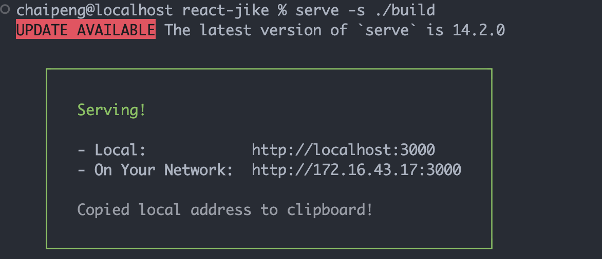

### 优化-路由懒加载

**使用步骤**

1. 使用 lazy 方法导入路由组件
2. 使用内置的 Suspense 组件渲染路由组件

**代码实现**
`router/index.js`

```jsx
import { createBrowserRouter } from 'react-router-dom'
import { lazy, Suspense } from 'react'
import Login from '@/pages/Login'
import Layout from '@/pages/Layout'

import AuthRoute from '@/components/Auth'

const Publish = lazy(() => import('@/pages/Publish'))
const Article = lazy(() => import('@/pages/Article'))
const Home = lazy(() => import('@/pages/Article'))


const router = createBrowserRouter([
  {
    path: '/',
    element: (
      <AuthRoute>
        <Layout />
      </AuthRoute>
    ),
    children: [
      {
        index: true,
        element: (
          <Suspense fallback={'加载中'}>
            <Home />
          </Suspense>
        )
      },
      {
        path: 'article',
        element: (
          <Suspense fallback={'加载中'}>
            <Article />
          </Suspense>
        )
      },
      {
        path: 'publish',
        element: (
          <Suspense fallback={'加载中'}>
            <Publish />
          </Suspense>
        )
      },
    ],
  },
  {
    path: '/login',
    element: <Login />,
  },
])

export default router
```

**查看效果**
我们可以在打包之后，通过切换路由，监控network面板资源的请求情况，验证是否分隔成功

### 打包-打包体积分析

**业务背景**
通过分析打包体积，才能知道项目中的哪部分内容体积过大，方便知道哪些包如何来优化
**使用步骤**

1. 安装分析打包体积的包：`npm i source-map-explorer`
2. 在 package.json 中的 scripts 标签中，添加分析打包体积的命令
3. 对项目打包：`npm run build`（如果已经打过包，可省略这一步）
4. 运行分析命令：`npm run analyze`
5. 通过浏览器打开的页面，分析图表中的包体积

**核心代码**：

```json
"scripts": {
  "analyze": "source-map-explorer 'build/static/js/*.js'",
}
```

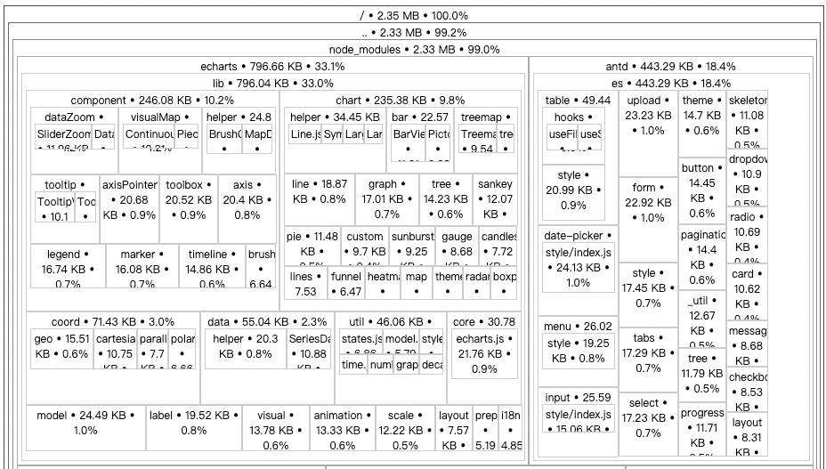

### 优化-配置CDN

**分析说明**：通过 craco 来修改 webpack 配置，从而实现 CDN 优化
**核心代码**
`craco.config.js`

```javascript
// 添加自定义对于webpack的配置

const path = require('path')
const { whenProd, getPlugin, pluginByName } = require('@craco/craco')

module.exports = {
  // webpack 配置
  webpack: {
    // 配置别名
    alias: {
      // 约定：使用 @ 表示 src 文件所在路径
      '@': path.resolve(__dirname, 'src')
    },
    // 配置webpack
    // 配置CDN
    configure: (webpackConfig) => {
      let cdn = {
        js:[]
      }
      whenProd(() => {
        // key: 不参与打包的包(由dependencies依赖项中的key决定)
        // value: cdn文件中 挂载于全局的变量名称 为了替换之前在开发环境下
        webpackConfig.externals = {
          react: 'React',
          'react-dom': 'ReactDOM'
        }
        // 配置现成的cdn资源地址
        // 实际开发的时候 用公司自己花钱买的cdn服务器
        cdn = {
          js: [
            'https://cdnjs.cloudflare.com/ajax/libs/react/18.1.0/umd/react.production.min.js',
            'https://cdnjs.cloudflare.com/ajax/libs/react-dom/18.1.0/umd/react-dom.production.min.js',
          ]
        }
      })

      // 通过 htmlWebpackPlugin插件 在public/index.html注入cdn资源url
      const { isFound, match } = getPlugin(
        webpackConfig,
        pluginByName('HtmlWebpackPlugin')
      )

      if (isFound) {
        // 找到了HtmlWebpackPlugin的插件
        match.userOptions.files = cdn
      }

      return webpackConfig
    }
  }
}
```

`public/index.html`

```html
<body>
  <div id="root"></div>
  <!-- 加载第三发包的 CDN 链接 -->
  <% htmlWebpackPlugin.options.files.js.forEach(cdnURL => { %>
    <script src="<%= cdnURL %>"></script>
  <% }) %>
</body>
```


# useReducer

## 基础使用

作用: 让 React 管理多个**相对关联**的状态数据

```jsx
import { useReducer } from 'react'

// 1. 定义reducer函数，根据不同的action返回不同的新状态
function reducer(state, action) {
  switch (action.type) {
    case 'INC':
      return state + 1
    case 'DEC':
      return state - 1
    default:
      return state
  }
}

function App() {
  // 2. 使用useReducer分派action
  const [state, dispatch] = useReducer(reducer, 0)
  return (
    <>
      {/* 3. 调用dispatch函数传入action对象 触发reducer函数，分派action操作，使用新状态更新视图 */}
      <button onClick={() => dispatch({ type: 'DEC' })}>-</button>
      {state}
      <button onClick={() => dispatch({ type: 'INC' })}>+</button>
    </>
  )
}

export default App
```

## 更新流程


## 分派action传参

> 做法：分派action时如果想要传递参数，需要在action对象中添加一个payload参数，放置状态参数

```jsx
// 定义reducer

import { useReducer } from 'react'

// 1. 根据不同的action返回不同的新状态
function reducer(state, action) {
  console.log('reducer执行了')
  switch (action.type) {
    case 'INC':
      return state + 1
    case 'DEC':
      return state - 1
    case 'UPDATE':
      return state + action.payload
    default:
      return state
  }
}

function App() {
  // 2. 使用useReducer分派action
  const [state, dispatch] = useReducer(reducer, 0)
  return (
    <>
      {/* 3. 调用dispatch函数传入action对象 触发reducer函数，分派action操作，使用新状态更新视图 */}
      <button onClick={() => dispatch({ type: 'DEC' })}>-</button>
      {state}
      <button onClick={() => dispatch({ type: 'INC' })}>+</button>
      <button onClick={() => dispatch({ type: 'UPDATE', payload: 100 })}>
        update to 100
      </button>
    </>
  )
}

export default App
```


# 渲染性能优化

## useMemo

作用：它在每次重新渲染的时候能够缓存计算的结果

### 看个场景

下面我们的本来的用意是想**基于count的变化计算斐波那契数列之和**，但是当我们修改num状态的时候，斐波那契求和函数也会被执行，显然是一种浪费

```jsx
// useMemo
// 作用：在组件渲染时缓存计算的结果

import { useState } from 'react'

function factorialOf(n) {
  console.log('斐波那契函数执行了')
  return n <= 0 ? 1 : n * factorialOf(n - 1)
}

function App() {
  const [count, setCount] = useState(0)
  // 计算斐波那契之和
  const sumByCount = factorialOf(count)

  const [num, setNum] = useState(0)

  return (
    <>
      {sum}
      <button onClick={() => setCount(count + 1)}>+count:{count}</button>
      <button onClick={() => setNum(num + 1)}>+num:{num}</button>
    </>
  )
}

export default App
```

### useMemo缓存计算结果

> 思路: 只有count发生变化时才重新进行计算

```jsx
import { useMemo, useState } from 'react'

function fib (n) {
  console.log('计算函数执行了')
  if (n < 3) return 1
  return fib(n - 2) + fib(n - 1)
}

function App() {
  const [count, setCount] = useState(0)
  // 计算斐波那契之和
  // const sum = fib(count)
  // 通过useMemo缓存计算结果，只有count发生变化时才重新计算
  const sum = useMemo(() => {
    return fib(count)
  }, [count])

  const [num, setNum] = useState(0)

  return (
    <>
      {sum}
      <button onClick={() => setCount(count + 1)}>+count:{count}</button>
      <button onClick={() => setNum(num + 1)}>+num:{num}</button>
    </>
  )
}

export default App
```

## React.memo

作用：允许组件在props没有改变的情况下跳过重新渲染

### 组件默认的渲染机制

> 默认机制：顶层组件发生重新渲染，这个组件树的子级组件都会被重新渲染

```jsx
// memo
// 作用：允许组件在props没有改变的情况下跳过重新渲染

import { useState } from 'react'

function Son() {
  console.log('子组件被重新渲染了')
  return <div>this is son</div>
}

function App() {
  const [, forceUpdate] = useState()
  console.log('父组件重新渲染了')
  return (
    <>
      <Son />
      <button onClick={() => forceUpdate(Math.random())}>update</button>
    </>
  )
}

export default App
```

### 使用React.memo优化

> 机制：只有props发生变化时才重新渲染
> 下面的子组件通过 memo 进行包裹之后，返回一个新的组件MemoSon, 只有传给MemoSon的props参数发生变化时才会重新渲染

```jsx
import React, { useState } from 'react'

const MemoSon = React.memo(function Son() {
  console.log('子组件被重新渲染了')
  return <div>this is span</div>
})

function App() {
  const [, forceUpdate] = useState()
  console.log('父组件重新渲染了')
  return (
    <>
      <MemoSon />
      <button onClick={() => forceUpdate(Math.random())}>update</button>
    </>
  )
}

export default App
```

### props变化重新渲染

```jsx
import React, { useState } from 'react'

const MemoSon = React.memo(function Son() {
  console.log('子组件被重新渲染了')
  return <div>this is span</div>
})

function App() {
  console.log('父组件重新渲染了')

  const [count, setCount] = useState(0)
  return (
    <>
      <MemoSon count={count} />
      <button onClick={() => setCount(count + 1)}>+{count}</button>
    </>
  )
}

export default App
```

### props的比较机制

> 对于props的比较，进行的是‘浅比较’，底层使用 `Object.is` 进行比较，针对于对象数据类型，只会对比俩次的引用是否相等，如果不相等就会重新渲染，React并不关心对象中的具体属性

```jsx
import React, { useState } from 'react'

const MemoSon = React.memo(function Son() {
  console.log('子组件被重新渲染了')
  return <div>this is span</div>
})

function App() {
  // const [count, setCount] = useState(0)
  const [list, setList] = useState([1, 2, 3])
  return (
    <>
      <MemoSon list={list} />
      <button onClick={() => setList([1, 2, 3])}>
        {JSON.stringify(list)}
      </button>
    </>
  )
}

export default App
```

说明：虽然俩次的list状态都是 `[1,2,3]` , 但是因为组件App俩次渲染生成了不同的对象引用list，所以传给MemoSon组件的props视为不同，子组件就会发生重新渲染

### 自定义比较函数

> 如果上一小节的例子，我们不想通过引用来比较，而是完全比较数组的成员是否完全一致，则可以通过自定义比较函数来实现

```jsx
import React, { useState } from 'react'

// 自定义比较函数
function arePropsEqual(oldProps, newProps) {
  console.log(oldProps, newProps)
  return (
    oldProps.list.length === newProps.list.length &&
    oldProps.list.every((oldItem, index) => {
      const newItem = newProps.list[index]
      console.log(newItem, oldItem)
      return oldItem === newItem
    })
  )
}

const MemoSon = React.memo(function Son() {
  console.log('子组件被重新渲染了')
  return <div>this is span</div>
}, arePropsEqual)

function App() {
  console.log('父组件重新渲染了')
  const [list, setList] = useState([1, 2, 3])
  return (
    <>
      <MemoSon list={list} />
      <button onClick={() => setList([1, 2, 3])}>
        内容一样{JSON.stringify(list)}
      </button>
      <button onClick={() => setList([4, 5, 6])}>
        内容不一样{JSON.stringify(list)}
      </button>
    </>
  )
}

export default App
```

## useCallback

### 看个场景

上一小节我们说到，当给子组件传递一个`引用类型`prop的时候，即使我们使用了`memo` 函数依旧无法阻止子组件的渲染，其实传递prop的时候，往往传递一个回调函数更为常见，比如实现子传父，此时如果想要避免子组件渲染，可以使用 `useCallback`缓存回调函数

```jsx
// useCallBack

import { memo, useState } from 'react'

const MemoSon = memo(function Son() {
  console.log('Son组件渲染了')
  return <div>this is son</div>
})

function App() {
  const [, forceUpate] = useState()
  console.log('父组件重新渲染了')
  const onGetSonMessage = (message) => {
    console.log(message)
  }

  return (
    <div>
      <MemoSon onGetSonMessage={onGetSonMessage} />
      <button onClick={() => forceUpate(Math.random())}>update</button>
    </div>
  )
}

export default App
```

### useCallback缓存函数

> useCallback缓存之后的函数可以在组件渲染时保持引用稳定，也就是返回同一个引用

```jsx
// useCallBack

import { memo, useCallback, useState } from 'react'

const MemoSon = memo(function Son() {
  console.log('Son组件渲染了')
  return <div>this is son</div>
})

function App() {
  const [, forceUpate] = useState()
  console.log('父组件重新渲染了')
  const onGetSonMessage = useCallback((message) => {
    console.log(message)
  }, [])

  return (
    <div>
      <MemoSon onGetSonMessage={onGetSonMessage} />
      <button onClick={() => forceUpate(Math.random())}>update</button>
    </div>
  )
}

export default App
```


# forwardRef + useImperativeHandle

## forwardRef

作用：允许组件使用ref将一个DOM节点暴露给父组件

```jsx
import { forwardRef, useRef } from 'react'

const MyInput = forwardRef(function Input(props, ref) {
  return <input {...props} type="text" ref={ref} />
}, [])

function App() {
  const ref = useRef(null)

  const focusHandle = () => {
    console.log(ref.current.focus())
  }

  return (
    <div>
      <MyInput ref={ref} />
      <button onClick={focusHandle}>focus</button>
    </div>
  )
}

export default App
```

## useImperativeHandle

作用：如果我们并不想暴露子组件中的DOM而是想暴露子组件内部的方法

```jsx
import { forwardRef, useImperativeHandle, useRef } from 'react'

const MyInput = forwardRef(function Input(props, ref) {
  // 实现内部的聚焦逻辑
  const inputRef = useRef(null)
  const focus = () => inputRef.current.focus()

  // 暴露子组件内部的聚焦方法
  useImperativeHandle(ref, () => {
    return {
      focus,
    }
  })

  return <input {...props} ref={inputRef} type="text" />
})

function App() {
  const ref = useRef(null)

  const focusHandle = () => ref.current.focus()

  return (
    <div>
      <MyInput ref={ref} />
      <button onClick={focusHandle}>focus</button>
    </div>
  )
}

export default App
```


# Class API

顾名思义，Class API就是使用ES6支持的原生Class API来编写React组件

## 基础体验

通过一个简单的 Counter 自增组件看一下组件的基础编写结构

```jsx
// class API
import { Component } from 'react'

class Counter extends Component {
  // 状态变量
  state = {
    count: 0,
  }

  // 事件回调
  clickHandler = () => {
    // 修改状态变量 触发UI组件渲染
    this.setState({
      count: this.state.count + 1,
    })
  }

  // UI模版
  render() {
    return <button onClick={this.clickHandler}>+{this.state.count}</button>
  }
}

function App() {
  return (
    <div>
      <Counter />
    </div>
  )
}

export default App
```

## 组件生命周期

### 组件通信

#### 父传子

```jsx
// class API
import { Component } from 'react'

class Son extends Component {
  render() {
    const { count } = this.props
    return <div>this is Son, {count}</div>
  }
}

class App extends Component {
  // 状态变量
  state = {
    count: 0,
  }

  setCount = () => {
    this.setState({
      count: this.state.count + 1,
    })
  }

  // UI模版
  render() {
    return (
      <>
        <Son count={this.state.count} />
        <button onClick={this.setCount}>+</button>
      </>
    )
  }
}

export default App
```

#### 子传父

```jsx
// class API
import { Component } from 'react'

class Son extends Component {
  render() {
    const { msg, onGetSonMsg } = this.props
    return (
      <>
        <div>this is Son, {msg}</div>
        <button onClick={() => onGetSonMsg('this is son msg')}>
          changeMsg
        </button>
      </>
    )
  }
}

class App extends Component {
  // 状态变量
  state = {
    msg: 'this is initail app msg',
  }

  onGetSonMsg = (msg) => {
    this.setState({ msg })
  }

  // UI模版
  render() {
    return (
      <>
        <Son msg={this.state.msg} onGetSonMsg={this.onGetSonMsg} />
      </>
    )
  }
}

export default App
```

更多阅读
[Component – React 中文文档](https://zh-hans.react.dev/reference/react/Component)


# zustand 

## 快速上手

[Zustand Documentation](https://docs.pmnd.rs/zustand/getting-started/introduction)

### store/index.js - 创建store

```javascript
import { create } from 'zustand'

const useStore = create((set) => {
  return {
    count: 0,
    inc: () => {
      set(state => ({ count: state.count + 1 }))
    }
  }
})

export default useStore
```

### app.js - 绑定组件

```jsx
import useStore from './store/useCounterStore.js'

function App() {
  const { count, inc } = useStore()
  return <button onClick={inc}>{count}</button>
}

export default App
```

## 异步支持

对于异步操作的支持不需要特殊的操作，直接在函数中编写异步逻辑，最后把接口的数据放到set函数中返回即可

### store/index.js - 创建store

```javascript
import { create } from 'zustand'

const URL = 'http://geek.itheima.net/v1_0/channels'

const useStore = create((set) => {
  return {
    count: 0,
    ins: () => {
      return set(state => ({ count: state.count + 1 }))
    },
    channelList: [],
    fetchChannelList: async () => {
      const res = await fetch(URL)
      const jsonData = await res.json()
      set({channelList: jsonData.data.channels})
    }
  }
})

export default useStore
```

### app.js - 绑定组件

```jsx
import { useEffect } from 'react'
import useChannelStore from './store/channelStore'

function App() {
  const { channelList, fetchChannelList } = useChannelStore()
 
  useEffect(() => {
    fetchChannelList()
  }, [fetchChannelList])

  return (
    <ul>
      {channelList.map((item) => (
        <li key={item.id}>{item.name}</li>
      ))}
    </ul>
  )
}

export default App
```

## 切片模式

场景：当我们单个store比较大的时候，可以采用一种`切片模式`进行模块拆分再组合

### 拆分并组合切片

```javascript
import { create } from 'zustand'

// 创建counter相关切片
const createCounterStore = (set) => {
  return {
    count: 0,
    setCount: () => {
      set(state => ({ count: state.count + 1 }))
    }
  }
}

// 创建channel相关切片
const createChannelStore = (set) => {
  return {
    channelList: [],
    fetchGetList: async () => {
      const res = await fetch(URL)
      const jsonData = await res.json()
      set({ channelList: jsonData.data.channels })
    }
  }
}

// 组合切片
const useStore = create((...a) => ({
  ...createCounterStore(...a),
  ...createChannelStore(...a)
}))
```

### 组件使用

```jsx
function App() {
  const {count, inc, channelList, fetchChannelList } = useStore()
  return (
    <>
      <button onClick={inc}>{count}</button>
      <ul>
        {channelList.map((item) => (
          <li key={item.id}>{item.name}</li>
        ))}
      </ul>
    </>
  )
}

export default App
```

## 对接DevTools

> 简单的调试我们可以安装一个 名称为 simple-zustand-devtools 的调试工具

### 安装调试包

```bash
npm i simple-zustand-devtools -D
```

### 配置调试工具

```javascript
import create from 'zustand'

// 导入核心方法
import { mountStoreDevtool } from 'simple-zustand-devtools'

// 省略部分代码...


// 开发环境开启调试
if (process.env.NODE_ENV === 'development') {
  mountStoreDevtool('channelStore', useChannelStore)
}


export default useChannelStore
```

### 打开 React调试工具


# 阶段重点与环境搭建

## 阶段重点

React和TypeScript集合使用的重点集中在 `和存储数据/状态有关的Hook函数` 以及 `组件接口` 的位置，这些地方最需要数据类型校验


## 使用Vite创建项目

> Vite是一个框架无关的前端工具链工具，可以帮助我们快速创建一个 `react+ts` 的工程化环境出来，我们可以基于它做语法学习

[Vite](https://cn.vitejs.dev/)

```bash
npm create vite@latest react-typescript -- --template react-ts
```

## 安装依赖运行项目

```bash
# 安装依赖
npm i 

# 运行项目
npm run dev
```


# Hooks与TypeScript

## useState

###  简单场景

> 简单场景下，可以使用TS的自动推断机制，不用特殊编写类型注解，运行良好

```typescript
const [val, toggle] = React.useState(false)

// `val` 会被自动推断为布尔类型
// `toggle` 方法调用时只能传入布尔类型
```

### 复杂场景

> 复杂数据类型，useState支持通过`泛型参数`指定初始参数类型以及setter函数的入参类型

```typescript
type User = {
  name: string
  age: number
}
const [user, setUser] = React.useState<User>({
  name: 'jack',
  age: 18
})
// 执行setUser
setUser(newUser)
// 这里newUser对象只能是User类型
```

### 没有具体默认值

> 实际开发时，有些时候useState的初始值可能为null或者undefined，按照泛型的写法是不能通过类型校验的，此时可以通过完整的类型联合null或者undefined类型即可

```typescript
type User = {
  name: String
  age: Number
}
const [user, setUser] = React.useState<User>(null)
// 上面会类型错误，因为null并不能分配给User类型

const [user, setUser] = React.useState<User | null>(null)
// 上面既可以在初始值设置为null，同时满足setter函数setUser的参数可以是具体的User类型
```

## useRef

> 在TypeScript的环境下，`useRef` 函数返回一个`只读` 或者 `可变` 的引用，只读的场景常见于获取真实dom，可变的场景，常见于缓存一些数据，不跟随组件渲染，下面分俩种情况说明

### 获取dom

> 获取DOM时，通过泛型参数指定具体的DOM元素类型即可

```tsx
function Foo() {
  // 尽可能提供一个具体的dom type, 可以帮助我们在用dom属性时有更明确的提示
  // divRef的类型为 RefObject<HTMLDivElement>
  const inputRef = useRef<HTMLDivElement>(null)

  useEffect(() => {
    inputRef.current.focus()
  })

  return <div ref={inputRef}>etc</div>
}
```

如果你可以确保`divRef.current` 不是null，也可以在传入初始值的位置

```typescript
// 添加非null标记
const divRef = useRef<HTMLDivElement>(null!)
// 不再需要检查`divRef.current` 是否为null
doSomethingWith(divRef.current)
```

### 稳定引用存储器

> 当做为可变存储容器使用的时候，可以通过`泛型参数`指定容器存入的数据类型, 在还为存入实际内容时通常把null作为初始值，所以依旧可以通过联合类型做指定

```tsx
interface User {
  age: number
}

function App(){
  const timerRef = useRef<number | undefined>(undefined)
  const userRes = useRef<User | null> (null)
  useEffect(()=>{
    timerRef.current = window.setInterval(()=>{
      console.log('测试')
    },1000)
    
    
    return ()=>clearInterval(timerRef.current)
  })
  return <div> this is app</div>
}
```


# Component与TypeScript

## 为Props添加类型

> props作为React组件的参数入口，添加了类型之后可以限制参数输入以及在使用props有良好的类型提示

### 使用interface接口

```tsx
interface Props {
  className: string
}

export const Button = (props:Props)=>{
  const { className } = props
  return <button className={ className }>Test</button>
}
```

### 使用自定义类型Type

```tsx
type Props =  {
  className: string
}

export const Button = (props:Props)=>{
  const { className } = props
  return <button className={ className }>Test</button>
}
```

## 为Props的chidren属性添加类型

> children属性和props中其他的属性不同，它是React系统中内置的，其它属性我们可以自由控制其类型，children属性的类型最好由React内置的类型提供，兼容多种类型


```tsx
type Props = {
  children: React.ReactNode
}

export const Button = (props: Props)=>{
   const { children } = props
   return <button>{ children }</button>
}
```

:::warning
说明：React.ReactNode是一个React内置的联合类型，包括 `React.ReactElement` 、`string`、`number` `React.ReactFragment` 、`React.ReactPortal` 、`boolean`、 `null` 、`undefined`
:::

## 为事件prop添加类型

```tsx
// props + ts
type Props = {
  onGetMsg?: (msg: string) => void
}

function Son(props: Props) {
  const { onGetMsg } = props
  const clickHandler = () => {
    onGetMsg?.('this is msg')
  }
  return <button onClick={clickHandler}>sendMsg</button>
}

function App() {
  const getMsgHandler = (msg: string) => {
    console.log(msg)
  }
  return (
    <>
      <Son onGetMsg={(msg) => console.log(msg)} />
      <Son onGetMsg={getMsgHandler} />
    </>
  )
}

export default App
```

## 为事件handle添加类型

> 为事件回调添加类型约束需要使用React内置的泛型函数来做，比如最常见的鼠标点击事件和表单输入事件：

```tsx
function App(){
  const changeHandler: React.ChangeEventHandler<HTMLInputElement> = (e)=>{
    console.log(e.target.value)
  }
  
  const clickHandler: React.MouseEventHandler<HTMLButtonElement> = (e)=>{
    console.log(e.target)
  }

  return (
    <>
      <input type="text" onChange={ changeHandler }/>
      <button onClick={ clickHandler }> click me!</button>
    </>
  )
}
```


# TS-项目

## 初始化项目

```bash
npm create vite@latest react-jike-mobile -- --template react-ts
```

### 安装依赖包

```bash
npm i 
```

### 清理项目目录结构

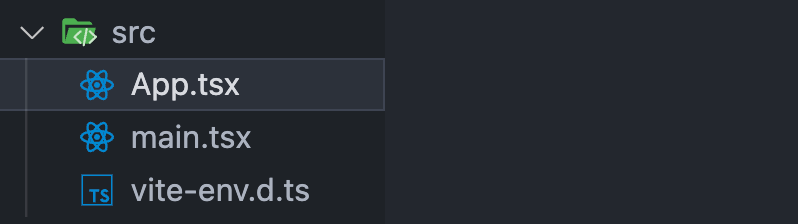

## 安装 antd-mobile

```bash
npm install --save antd-mobile
```

### 测试组件

```bash
import { Button } from 'antd-mobile'

function App() {
  return (
    <>
      <Button>click me </Button>
    </>
  )
}

export default App
```

## 初始化路由

### 安装路由

```bash
npm i react-router-dom
```

### 配置基础路由

```tsx
const List = () => {
  return <div>this is List</div>
}

export default List
```

```tsx
const Detail = () => {
  return <div>this is Detail</div>
}

export default Detail
```

```tsx
import { createBrowserRouter } from 'react-router-dom'
import List from '../pages/List'
import Detail from '../pages/Detail'

const router = createBrowserRouter([
  {
    path: '/',
    element: <List />,
  },
  {
    path: '/detail',
    element: <Detail />,
  },
])

export default router
```

```tsx
import ReactDOM from 'react-dom/client'
import { RouterProvider } from 'react-router-dom'
import router from './router/index.tsx'

ReactDOM.createRoot(document.getElementById('root')!).render(
  <RouterProvider router={router} />
)
```

## 配置路径别名

### 修改vite配置

```javascript
import { defineConfig } from 'vite'
import react from '@vitejs/plugin-react'
import path from 'path'

// https://vitejs.dev/config/
export default defineConfig({
  plugins: [react()],
  resolve: {
    alias: {
      '@': path.resolve(__dirname, './src'),
    },
  },
})

```

### 安装node类型包

```bash
npm i @types/node -D
```

### 修改tsconfig.json文件

```json
{
  "baseUrl": ".",
  "paths": {
    "@/*": [
      "src/*"
    ]
  },
}
```

## axios安装配置

### 安装axios

```bash
npm i axios
```

### 简易封装

```typescript
import axios from 'axios'

const requestInstance = axios.create({
  baseURL: 'http://geek.itheima.net/v1_0',
  timeout: 5000,
})

requestInstance.interceptors.request.use(
  (config) => {
    return config
  },
  (error) => {
    return Promise.reject(error)
  }
)

requestInstance.interceptors.response.use(
  (response) => {
    return response
  },
  (error) => {
    return Promise.reject(error)
  }
)

export default requestInstance
```

```typescript
import requestInstance from './http'

export { requestInstance as http }
```

## API模块测试使用

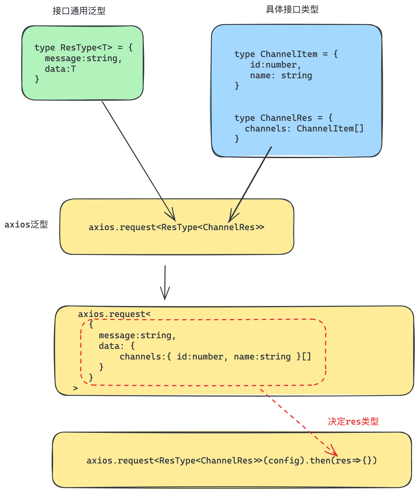

### 封装泛型

[获取-所有频道列表 - 黑马前端](https://apifox.com/apidoc/shared-fa9274ac-362e-4905-806b-6135df6aa90e/api-23348775)

```typescript
export type ResType<T> = {
  message: string
  data: T
}
```

### 封装请求函数

```tsx
import { http } from '@/utils'
import type { ResType } from './shared'

type ChannelRes = {
  channels: { id: number; name: string }[]
}

export function fetchChannelAPI() {
  return http.request<ResType<ChannelRes>>({
    url: '/channels',
  })
}
```

### 测试API函数

```typescript
fetchChannelAPI().then((res) => {
  console.log(res.data.data.channels)
})
```


## 整体结构设计


### 准备Home入口组件

```tsx
import './style.css'

const Home = () => {
  return (
    <div>Home</div>
  )
}

export default Home
```

### 准备配套样式

```css
.tabContainer {
  position: fixed;
  height: 50px;
  top: 0;
  width: 100%;
}

.listContainer {
  position: fixed;
  top: 50px;
  bottom: 0px;
  width: 100%;
}
```

## Tabs模块实现

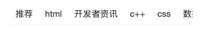

### 准备结构

```tsx
import { Tabs } from 'antd-mobile'
import './style.css'

const Home = () => {
  return (
    <div className="tabContainer">
       <Tabs defaultActiveKey="0">
          <Tabs.Tab title='abc' key='0'>
            <div className="listContainer">
               {/* HomeList列表 */}
            </div>
          </Tabs.Tab>
      </Tabs>
      {/*
        <Tabs>
         <Tabs.Tab title='水果' key='fruits'>
            菠萝
          </Tabs.Tab>
          <Tabs.Tab title='蔬菜' key='vegetables'>
            西红柿
          </Tabs.Tab>
          <Tabs.Tab title='动物' key='animals'>
            蚂蚁
          </Tabs.Tab>
        </Tabs>
       */
      }
    </div>
  )
}

export default Home
```

### 封装接口和类型

```typescript
import { http } from '@/utils'
import type { ResType } from './shared'

export type ChannelItem = {
  id: string
  name: string
}

type ChannelRes = {
  channels: ChannelItem[]
}

export function fetchChannelAPI() {
  return http.request<ResType<ChannelRes>>({
    url: '/channels',
  })
}
```

### 封装数据请求hook

```typescript
import { fetchChannelAPI } from '@/apis/list'
import type { ChannelItem } from '@/apis/list'
import { useEffect, useState } from 'react'

function useFetchChannels() {
  const [channels, setChannels] = useState<ChannelItem[]>([])
  useEffect(() => {
    async function getChannels() {
      try {
        const { data } = await fetchChannelAPI()
        setChannels(data.data.channels)
      } catch (error) {
        throw new Error('fetch channels error')
      }
    }
    getChannels()
  }, [])
  return {
    channels,
  }
}

export { useFetchChannels }
```

### 调用hook渲染数据

```tsx
import { Tabs } from 'antd-mobile'
import HomeList from './HomeList'
import { useFetchChannels } from './useFetchChannels'

import './style.css'

const Home = () => {
  const { channels } = useFetchChannels()

  return (
    <Tabs defaultActiveKey="0">
      {channels.map((item) => (
        <Tabs.Tab title={item.name} key={item.id}>
          <div className="listContainer">
             {/* HomeList列表 */}
          </div>
        </Tabs.Tab>
      ))}
    </Tabs>
  )
}

export default Home
```

## List模块实现-渲染基础数据

### 准备基础结构

```tsx
import { Image, List } from 'antd-mobile'
// mock数据
import { users } from './users'

const HomeList = () => {
  return (
    <>
      <List>
        {users.map((item) => (
          <List.Item
            key={item.id}
            prefix={
              <Image
                src={item.avatar}
                style={{ borderRadius: 20 }}
                fit="cover"
                width={40}
                height={40}
              />
            }
            description={item.description}
            >
            {item.name}
          </List.Item>
        ))}
      </List>
    </>
  )
}

export default HomeList
```

```typescript
export const users = [
  {
    id: '1',
    avatar:
      'https://images.unsplash.com/photo-1548532928-b34e3be62fc6?ixlib=rb-1.2.1&q=80&fm=jpg&crop=faces&fit=crop&h=200&w=200&ixid=eyJhcHBfaWQiOjE3Nzg0fQ',
    name: 'Novalee Spicer',
    description: 'Deserunt dolor ea eaque eos',
  },
  {
    id: '2',
    avatar:
      'https://images.unsplash.com/photo-1493666438817-866a91353ca9?ixlib=rb-0.3.5&q=80&fm=jpg&crop=faces&fit=crop&h=200&w=200&s=b616b2c5b373a80ffc9636ba24f7a4a9',
    name: 'Sara Koivisto',
    description: 'Animi eius expedita, explicabo',
  },
  {
    id: '3',
    avatar:
      'https://images.unsplash.com/photo-1542624937-8d1e9f53c1b9?ixlib=rb-1.2.1&q=80&fm=jpg&crop=faces&fit=crop&h=200&w=200&ixid=eyJhcHBfaWQiOjE3Nzg0fQ',
    name: 'Marco Gregg',
    description: 'Ab animi cumque eveniet ex harum nam odio omnis',
  },
  {
    id: '4',
    avatar:
      'https://images.unsplash.com/photo-1546967191-fdfb13ed6b1e?ixlib=rb-1.2.1&q=80&fm=jpg&crop=faces&fit=crop&h=200&w=200&ixid=eyJhcHBfaWQiOjE3Nzg0fQ',
    name: 'Edith Koenig',
    description: 'Commodi earum exercitationem id numquam vitae',
  },
]
```

### 封装请求API

```typescript
export type ListParams = {
  channel_id: string
  timestamp: string
}

type ListItem = {
  art_id: string
  title: string
  aut_id: string
  comm_count: number
  pubdate: string
  aut_name: string
  is_top: 0 | 1
  cover: {
    type: 0 | 1 | 3
    images: string[]
  }
}

export type ListRes = {
  results: ListItem[]
  pre_timestamp: string
}

export function fetchListAPI(params: ListParams) {
  return http.request<ResType<ListRes>>({
    url: '/articles',
    params,
  })
}
```

### 获取渲染基础列表数据

```tsx
import { ListRes, fetchListAPI } from '@/apis/list'
import { Image, List } from 'antd-mobile'
import { useState, useEffect } from 'react'

const HomeList = (props: Props) => {
  const { channelId } = props
  // list control
  const [listRes, setListRes] = useState<ListRes>({
    results: [],
    pre_timestamp: '' + new Date().getTime(),
  })
  // 初始数据获取
  useEffect(() => {
    async function getList() {
      try {
        const res = await fetchListAPI({
          channel_id: '0',
          timestamp: '' + new Date().getTime(),
        })
        setListRes(res.data.data)
      } catch (error) {
        throw new Error('fetch list error')
      }
    }
    getList()
  }, [])

  return (
    <>
      <List>
        {listRes.results.map((item) => (
          <List.Item
            key={item.art_id}
            prefix={
              <Image
                src={item.cover.images?.[0]}
                style={{ borderRadius: 20 }}
                fit="cover"
                width={40}
                height={40}
              />
            }
            description={item.pubdate}>
            >
            {item.title}
          </List.Item>
        ))}
      </List>
    </>
  )
}

export default HomeList
```

## List模块实现-传入不同channelId

### 设计组件props

```tsx
import { ListRes, fetchListAPI } from '@/apis/list'
import { Image, List, InfiniteScroll } from 'antd-mobile'
import { useState, useEffect } from 'react'

type Props = {
  channelId: string
}

const HomeList = (props: Props) => {
  const { channelId } = props
  // list control
  const [listRes, setListRes] = useState<ListRes>({
    results: [],
    pre_timestamp: '' + new Date().getTime(),
  })
  // 初始数据获取
  useEffect(() => {
    async function getList() {
      try {
        const res = await fetchListAPI({
          channel_id: channelId,
          timestamp: '' + new Date().getTime(),
        })
        setListRes(res.data.data)
      } catch (error) {
        throw new Error('fetch list error')
      }
    }
    getList()
  }, [channelId])
  
  return (
    <>
      <List>
        {listRes.results.map((item) => (
          <List.Item
            key={item.art_id}
            prefix={
              <Image
                src={item.cover.images?.[0]}
                style={{ borderRadius: 20 }}
                fit="cover"
                width={40}
                height={40}
              />
            }>
            {item.title}
          </List.Item>
        ))}
      </List>
    </>
  )
}

export default HomeList
```

### 组件传入不同channelId

```tsx
<Tabs.Tab title={item.name} key={item.id}>
  {/* list组件 */}
  <HomeList channelId={'' + item.id} />
</Tabs.Tab>
```

## List模块无限加载实现

### 确保滑动结构

```tsx
<div className="listContainer">
   {/* HomeList列表 */}
</div>
```

### 2.实现上拉逻辑

```typescript
import { ListRes, fetchListAPI } from '@/apis/list'
import { Image, List, InfiniteScroll } from 'antd-mobile'
import { useState, useEffect } from 'react'

type Props = {
  channelId: string
}

const HomeList = (props: Props) => {
  const { channelId } = props
  // list control
  const [listRes, setListRes] = useState<ListRes>({
    results: [],
    pre_timestamp: '' + new Date().getTime(),
  })
  // 初始数据获取
  useEffect(() => {
    async function getList() {
      try {
        const res = await fetchListAPI({
          channel_id: channelId,
          timestamp: '' + new Date().getTime(),
        })
        setListRes(res.data.data)
      } catch (error) {
        throw new Error('fetch list error')
      }
    }
    getList()
  }, [channelId])

  // 加载更多
  const [hasMore, setHadMore] = useState(true)
  const loadMore = async () => {
    try {
      const res = await fetchListAPI({
        channel_id: channelId,
        timestamp: listRes.pre_timestamp,
      })
      // 没有数据立刻停止
      if (res.data.data.results.length === 0) {
        setHadMore(false)
      }
      setListRes({
        // 拼接新老列表数据
        results: [...listRes.results, ...res.data.data.results],
        // 重置时间参数 为下一次请求做准备
        pre_timestamp: res.data.data.pre_timestamp,
      })
    } catch (error) {
      throw new Error('load list error')
    }
  }
  
  return (
    <>
      <List>
        {listRes.results.map((item) => (
          <List.Item
            key={item.art_id}
            prefix={
              <Image
                src={item.cover.images?.[0]}
                style={{ borderRadius: 20 }}
                fit="cover"
                width={40}
                height={40}
              />
            }>
            {item.title}
          </List.Item>
        ))}
      </List>
      <InfiniteScroll loadMore={loadMore} hasMore={hasMore} />
    </>
  )
}

export default HomeList
```


## 路由跳转传参

```tsx
const navigateToDetail = (id: string) => {
  navigate(`/detail?id=${id}`)
}

<List.Item
  key={item.art_id}
  onClick={() => navigateToDetail(item.art_id)}
  arrow={false}
>
	{item.title}
</List.Item>
```

## 获取详情数据

```typescript
import { http } from '@/utils'
import { ResType } from './shared'

export type DetailRes = {
  art_id: string
  title: string
  pubdate: string
  content: string
}

export function fetchDetailAPI(article_id: string) {
  return http.request<ResType<DetailRes>>({
    url: `/articles/${article_id}`,
  })
}
```

```tsx
import { NavBar } from 'antd-mobile'
import { useEffect, useState } from 'react'
import { DetailRes, fetchDetailAPI } from '@/apis/detail'
import { useNavigate, useSearchParams } from 'react-router-dom'
const Detail = () => {
  const [detail, setDetail] = useState<DetailRes | null>(null)
  const [params] = useSearchParams()
  const id = params.get('id')
  useEffect(() => {
    async function getDetail() {
      try {
        const res = await fetchDetailAPI(id!)
        setDetail(res.data.data)
      } catch (error) {
        throw new Error('fetch detail error')
      }
    }
    if (id) {
      getDetail()
    }
  }, [id])
  const navigate = useNavigate()
  const back = () => navigate(-1)

  if (!detail) {
    return <div>this is loading</div>
  }
  return (
    <div>
      <NavBar onBack={back}>{detail.title}</NavBar>
      <div dangerouslySetInnerHTML={{ __html: detail.content }}></div>
    </div>
  )
}

export default Detail
```


# 完结撒花
